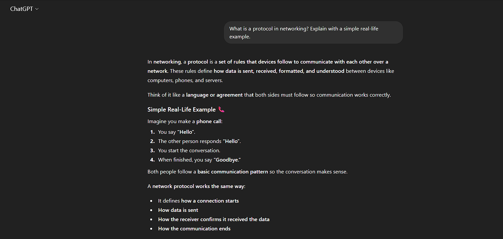
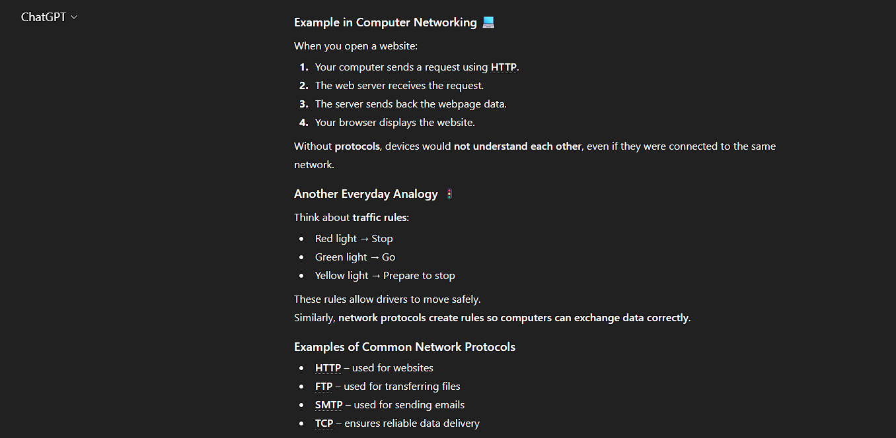
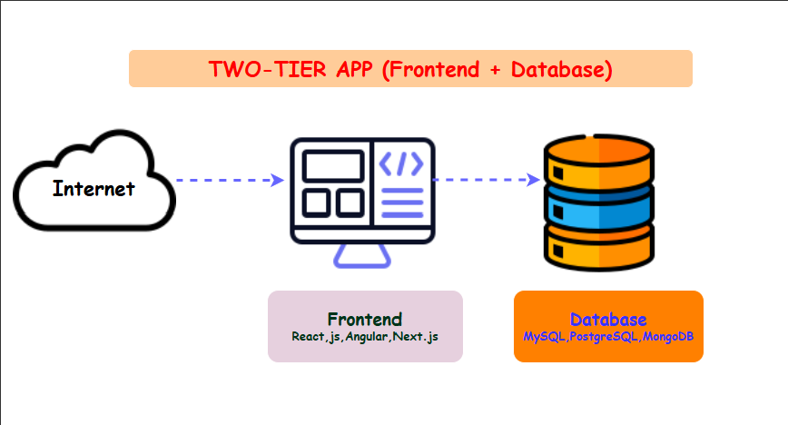
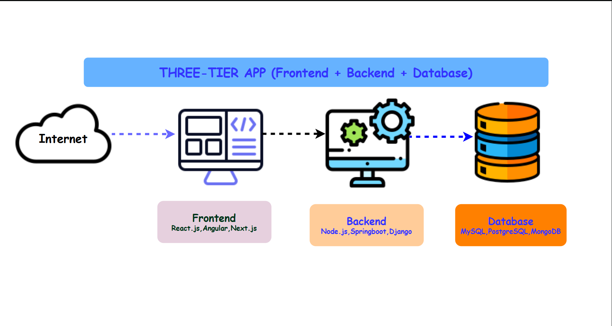
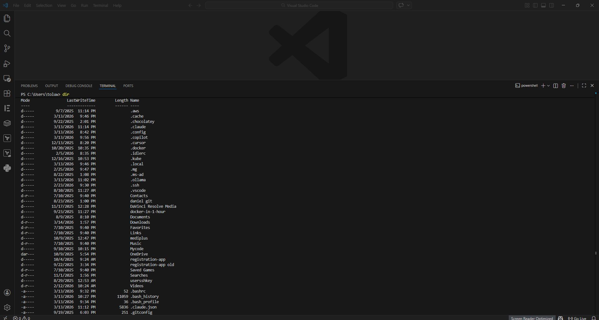

# Week 00 - Internet and Networking

Part of the DevOps Micro Internship (DMI) Cohort 3 with Agentic AI

---

# 🧑‍💻 Task 1: Using ChatGPT as Your Learning Assistant

## Scenario

You're new to DevOps and will frequently encounter technical questions. ChatGPT can be your learning companion.

## Your Task

Write a clear ChatGPT prompt to help you understand:

> "What is a protocol in networking? Explain with a simple real-life example."

Take a screenshot of your interaction showing:

* Your detailed prompt (with clear expectations)
* ChatGPT's simplified response with an example

## Screenshot

Save your screenshot in the `screenshots` folder and update the file name below.





Replace `task-1-chatgpt.png` with your actual screenshot file name.

---

## What I Learned (2–3 lines)

I learned that networking protocols are the rules that allow devices to communicate and exchange data reliably over a network. I also understood that different protocols, such as HTTP, HTTPS, SSH, and TCP, have specific purposes to ensure secure, efficient, and accurate communication between devices.

---

# 🌐 Task 2: Internet and Networking

## Scenario

Your friend is launching an online bookstore named **EpicReads**.

He asked you to explain how users globally can access his website hosted in Finland.

## Your Task

Write a short explanation (**100–150 words**) that includes:

* Packet Switching
* IP Address
* TCP/IP
* HTTP/HTTPS

💡 **Tip:** You may use ChatGPT (as demonstrated in Task 1) to refine your explanation.

## Answer

When a user anywhere in the world visits the EpicReads website, their browser sends a request using HTTP or HTTPS (the secure version that encrypts data). The request travels across the internet using the TCP/IP protocol suite. TCP ensures the data is delivered accurately and in the correct order, while IP uses the website's unique IP address to route the request to the server hosted in Finland. The data is divided into smaller pieces called packets, a process known as packet switching. These packets may travel along different routes but are reassembled correctly when they reach the server. The server then sends the requested web pages back to the user's browser, allowing people from anywhere in the world to access EpicReads quickly and securely.

---

# 🏗️ Task 3: Application Architecture & Stack

## Scenario

EpicReads bookstore has two application versions:

### Two-Tier Application

* Frontend
* Database

### Three-Tier Application

* Frontend
* Backend
* Database

## Your Task

* Draw simple diagrams (hand-drawn or tool-based such as draw.io)
* Label each layer clearly
* List at least two common technologies or tools used for each layer
* Submit a screenshot or photo clearly showing your own drawing

## Diagram Screenshot / Photo

Save your diagram image in the `screenshots` folder and update the file name below.





Replace `task-3-diagram.png` with your actual diagram file name.

---

## Technologies Used

### Frontend

* React
* Angular

### Backend

* Node.js
* Django

### Database

* MySQL
* MongoDB

---

# 🌍 Task 4: Domain Name & DNS (Basic Concepts)

## Scenario

Your friend's bookstore **EpicReads** is currently accessible through:

```text
52.172.142.222:3000
```

He purchased the domain:

```text
epicreads.com
```

## Your Task

In **50–100 words**, explain in your own words:

1. What is DNS (Domain Name System)?
2. Which DNS record type should be used to connect the domain to the given IP, and why?

## Answer

The Domain Name System is the system that translates human-friendly domain names into IP addresses that computers use to find servers on the Internet. Instead of remembering an IP like 52.172.142.222, users can simply type epicreads.com in their browser. DNS then looks up the correct IP and directs the request to the server hosting the website.
To connect the domain epicreads.com to the server, the correct record type is an A Record. An A record maps a domain name directly to an IPv4 address, allowing visitors who enter epicreads.com to reach the server at 52.172.142.222.


---

# 💻 Task 5: Visual Studio Code Setup (Hands-on)

## Your Task

Install Visual Studio Code (if not already installed).

Take a screenshot of your VS Code environment showing:

* Terminal open inside VS Code
* Running a basic command:

### Windows

```powershell
dir
```

### Linux / macOS

```bash
pwd
ls
```

* Your selected VS Code theme clearly visible

⚠️ **Important:** The screenshot must show your username or another identifiable detail to confirm it is your environment.

## Screenshot

Save your screenshot in the `screenshots` folder and update the file name below.




Replace `task-5-vscode.png` with your actual screenshot file name.

---

# 🔗 Task 6: Publish Your Assignment as a LinkedIn Post

## Objective

Publishing on LinkedIn helps you:

* Build your professional online presence
* Reinforce your learning
* Document your DevOps journey publicly

## Your Task

Summarize your answers from Tasks 1–5 into a LinkedIn post.

Clearly structure your post into the following sections:

* ChatGPT
* Internet & Networking
* App Architecture
* DNS
* VS Code Setup

Add the following credit note at the end of your post:

> **P.S. This post is part of the DevOps Micro Internship (DMI) with Agentic AI — Cohort 3 — by Pravin Mishra. My graded progress is public: https://dmi.pravinmishra.com/s/YOUR-GITHUB-USERNAME.html · Start your DevOps journey: https://dmi.pravinmishra.com/?utm_source=student&utm_medium=ps-linkedin&utm_campaign=cohort3**

---

## LinkedIn Post URL

Paste your LinkedIn post URL here:

https://www.linkedin.com/posts/toluwalase-koroma-9678b736a_pravin-mishra-the-cloudadvisory-linkedin-activity-7438948185684975616-HMgH?utm_source=share&utm_medium=member_desktop&rcm=ACoAAFudL58B_KdACca6x5LqOifva91Ab5ggM3o

```

---

## LinkedIn Post Backup Copy

Paste the full text of your LinkedIn post here:

This week has been incredibly exciting! As a part of the DevOps Micro Internship Cohort, I’ve been exploring the fundamentals of DevOps, and I’m gaining so much hands-on knowledge. Here’s a quick snapshot of what stood out to me.

🤖 𝗖𝗵𝗮𝘁𝗚𝗣𝗧
I used ChatGPT to research and clarify technical concepts. It helped me understand networking, DNS, and system architecture better and allowed me to practice explaining these topics in simple, clear terms. 
AI has been a major game-changer in DevOps; all it takes is a clear, detailed prompt, and you can see the results instantly. It’s like having a personal guide through complex concepts.

🌐 𝐈𝐧𝐭𝐞𝐫𝐧𝐞𝐭 & 𝐍𝐞𝐭𝐰𝐨𝐫𝐤𝐢𝐧𝐠
I learned how people from anywhere in the world can access a website.
Key takeaways:
✔Data is broken into small packets using Packet Switching for efficient delivery.
✔Every device has a unique IP Address, which allows communication.
✔Data travels according to TCP/IP rules.
✔Websites are delivered via HTTP or secure HTTPS.

🧱 𝐀𝐩𝐩 𝐀𝐫𝐜𝐡𝐢𝐭𝐞𝐜𝐭𝐮𝐫𝐞
I studied two-tier and three-tier web application architectures:
✔𝐓𝐰𝐨-𝐓𝐢𝐞𝐫 (𝐅𝐫𝐨𝐧𝐭𝐞𝐧𝐝 + 𝐃𝐚𝐭𝐚𝐛𝐚𝐬𝐞):
Technologies: HTML, CSS, JavaScript, MySQL, PostgreSQL
✔𝐓𝐡𝐫𝐞𝐞-𝐓𝐢𝐞𝐫 (𝐅𝐫𝐨𝐧𝐭𝐞𝐧𝐝 + 𝐁𝐚𝐜𝐤𝐞𝐧𝐝 + 𝐃𝐚𝐭𝐚𝐛𝐚𝐬𝐞):
Technologies: React, Angular, Node.js, Django, MySQL, MongoDB

🌍 𝐃𝐍𝐒
I learned about the 𝐃𝐨𝐦𝐚𝐢𝐧 𝐍𝐚𝐦𝐞 𝐒𝐲𝐬𝐭𝐞𝐦, which translates easy-to-remember domain names into IP addresses.
✔To connect a domain like https://www.epicreads.com/ to a server IP 52.172.142.222, an A Record is used.
✔This allows users to type a domain instead of remembering numeric IP addresses.

💻 𝐕𝐒 𝐂𝐨𝐝𝐞 𝐒𝐞𝐭𝐮𝐩
With Visual Studio Code already installed, I jumped straight into its integrated terminal, running basic commands like pwd and dir. I also explored different VS Code themes, because a cool theme makes coding way more enjoyable 😄. Getting hands-on with the terminal has boosted my confidence in working within a real development environment.

This experience helped me connect theoretical concepts to practical applications. From understanding how the internet works to setting up development tools, I now feel more confident building and managing modern web applications.

What networking or DevOps concept confused you the most when you first started learning?

P.S. This post is part of the FREE DevOps Micro Internship (DMI) Cohort 3 led by Pravin Mishra. You can be a part of this learning community too.

🔗 Join the community: https://lnkd.in/dAPGPrXg
📝 DMI Cohort 3 Registration: https://lnkd.in/dV2zSGBJ
👤 Pravin Mishra LinkedIn: https://lnkd.in/deFnFymx

---

# Reflection – Week 0

### What did you find easy?

I found them all easy because I am familiar with the terms.

---

### What was difficult?

Nothing was difficult
---

### What will you improve next week?

I will expand my knowledge in networking

---

## 📌 About DMI & CloudAdvisory

DevOps Micro Internship (DMI) is a project-based DevOps program run by Pravin Mishra (The CloudAdvisory) focused on real-world execution, systems thinking, and career readiness.

It helps learners build strong DevOps foundations with hands-on experience.


## 📌 Resources

- 🌐 **DMI Official Website:** https://dmi.pravinmishra.com?utm_source=github&utm_medium=readme  
- 🎓 **University:** https://university.pravinmishra.com?utm_source=github&utm_medium=readme  
- 💬 **Discord Community:** https://discord.pravinmishra.com?utm_source=github&utm_medium=readme  
- 📝 **Blog:** https://dmi.pravinmishra.com/blog?utm_source=github&utm_medium=readme  
- ▶️ **YouTube Playlist (DMI Cohort 3):** https://www.youtube.com/playlist?list=PLFeSNDtI4Cho  
- 🔗 **Pravin Mishra (LinkedIn):** https://www.linkedin.com/in/pravin-mishra-aws-trainer/  
- 🏢 **CloudAdvisory (LinkedIn):** https://www.linkedin.com/company/thecloudadvisory/

---

*This submission is part of DevOps Micro Internship (DMI) Cohort 3 — Agentic AI Track*