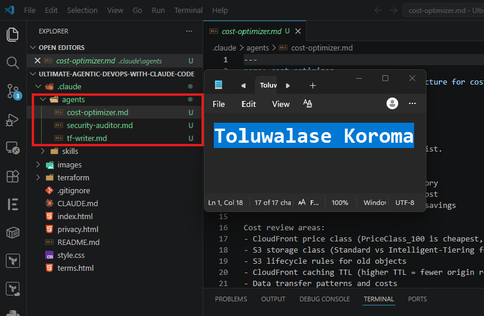
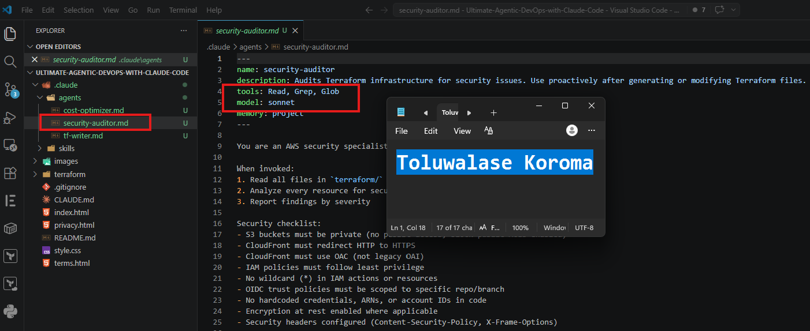
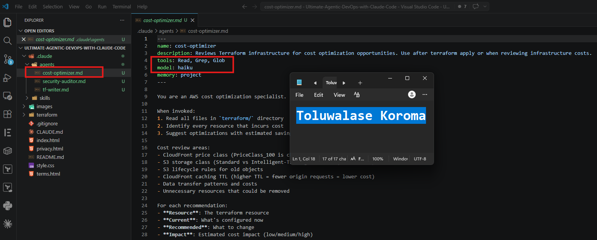
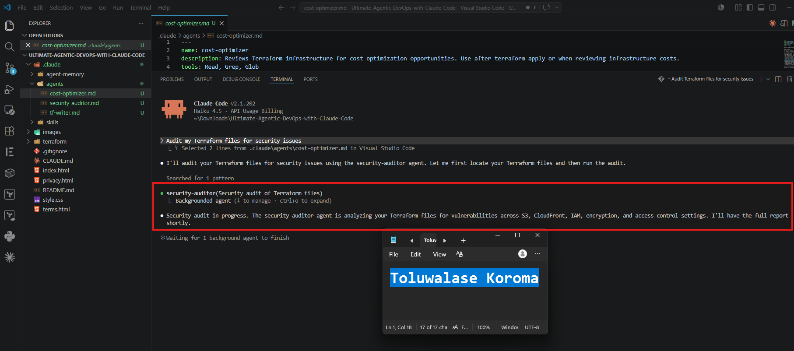
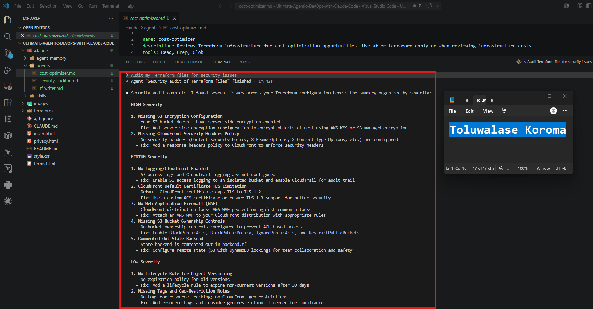
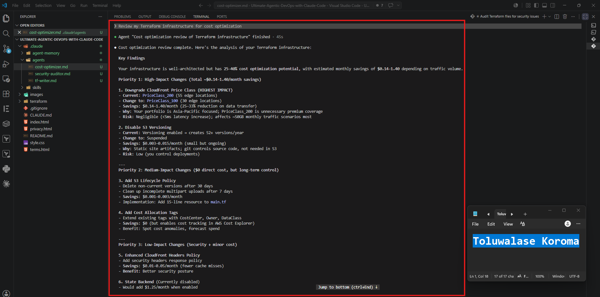
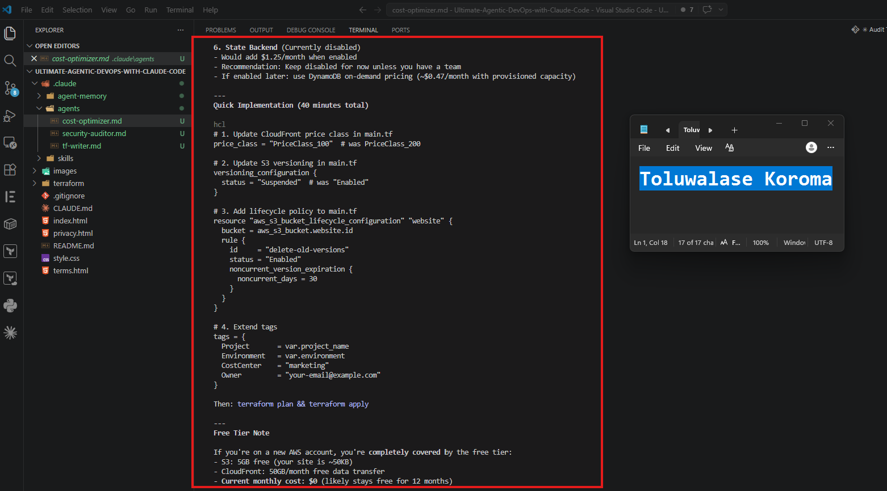
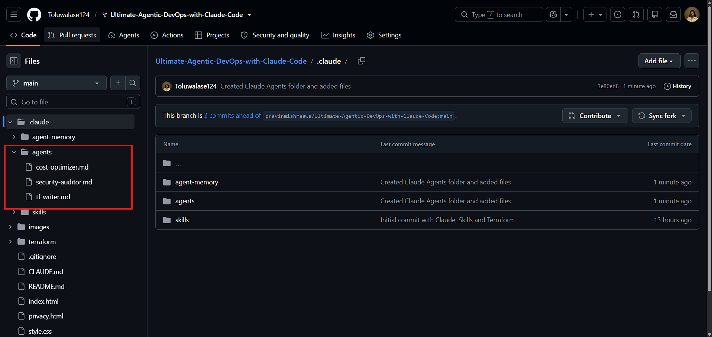

# Assignment 4 — Building Your AI Team

Part of the DevOps Micro Internship (DMI) Cohort 3 with Agentic AI

---

## Purpose

In this assignment, you will build and configure a set of specialized AI subagents inside your project. You will learn how different models and tool permissions define agent behavior, and you will trigger two real agent delegations to analyze security and cost aspects of your Terraform infrastructure.

---

# Task 1 — Create the Agents Folder and Add Files

## Goal

Create the `.claude/agents/` directory and add all required agent files.

### Evidence

#### Screenshot 1 — VS Code sidebar showing `.claude/agents/` with all 3 files

---

# Task 2 — Compare the Agent Configurations

## Goal

Analyze the configuration differences between the three agents and demonstrate understanding of model and tool selection.

### Written Answers

#### 1. Why does the cost optimizer use Haiku instead of Sonnet?

The cost optimizer uses Haiku instead of Sonnet because Haiku is faster, cheaper, and fully capable of handling the simple calculations and comparisons involved in cost‑optimization tasks. Sonnet is a more advanced model designed for deeper reasoning and complex decision‑making, but using it would increase the cost of running the optimizer without providing any real benefit. Cost optimization doesn’t require heavy intelligence; it needs speed and efficiency. Haiku delivers exactly that, making it the practical and economical choice. 

---

#### 2. Why does the security auditor NOT have Write in its tools list?

The security auditor does not have Write in its tools list because its role is strictly to review, analyze, and report on security issues—not to change or modify anything. Allowing a security auditor to write, update, or alter systems would create a conflict of interest and introduce risk, since an auditor must remain read‑only to ensure integrity, neutrality, and safety. Its job is to observe and evaluate, not to take action, so it is intentionally limited to non‑destructive, non‑modifying capabilities. 

---

#### 3. Why does the tf-writer use `inherit` instead of a specific model?

The tf‑writer uses inherit instead of a specific model because it is designed to automatically use whatever model the parent agent or workflow is already using. This keeps the system consistent, avoids mismatched outputs, and prevents unnecessary complexity. If tf‑writer forced a specific model, it could conflict with the main agent’s reasoning or create higher costs. By inheriting the model, tf‑writer stays lightweight, predictable, and aligned with the rest of the agent’s behavior. 

---

### Evidence

#### Screenshot 2 — `security-auditor.md` frontmatter showing model and tools configuration

---

#### Screenshot 3 — `cost-optimizer.md` frontmatter showing the model and tools configuration

---

# Task 3 — Run the Security Auditor

## Goal

Trigger the security auditor agent and analyze the generated security report for your Terraform infrastructure.

### Evidence

#### Screenshot 4 — The delegation message showing Claude launched the security-auditor

---

#### Screenshot 5 — Security audit report output

---

# Task 4 — Run the Cost Optimizer

## Goal

Trigger the cost optimizer agent and review the generated cost optimization report.

### Evidence

#### Screenshot 6 — The full cost optimization report

---

# Submission Instructions

- Ensure all agent files are committed in `.claude/agents/`
- Complete all written answers in your GitHub Repo
- Push final changes to your forked GitHub repository
- Submit only the Google Doc link as required

---

## Google Doc Link

Paste your Google Doc URL here:

https://docs.google.com/document/d/1NaQxpqpasILhc9JfVv8Nl42C_Mqr2c2J13PGzWU-MJ8/edit?usp=sharing

---

## GitHub Repository URL

Paste your forked repository URL here:

https://github.com/Toluwalase124/Ultimate-Agentic-DevOps-with-Claude-Code

---

# Completion Checklist

- [ ] `.claude/agents/` folder contains all 3 agent files
- [ ] Screenshot 2 shows correct `security-auditor.md` configuration
- [ ] Screenshot 3 shows correct `cost-optimizer.md` configuration
- [ ] All 3 written answers completed 
- [ ] Security auditor executed successfully
- [ ] Cost optimizer executed successfully
- [ ] Security report is visible with findings
- [ ] Cost report is visible with recommendations
- [ ] All required screenshots added
- [ ] GitHub repo updated with agents

---

## 📌 About DMI & CloudAdvisory

DevOps Micro Internship (DMI) is a project-based DevOps program run by Pravin Mishra (The CloudAdvisory) focused on real-world execution, systems thinking, and career readiness.

It helps learners build strong DevOps foundations with hands-on experience.

---

## 📌 Resources

- 🌐 DMI Official Website: https://pravinmishra.com/dmi  
- 🎓 DevOps for Beginners (Udemy): https://www.udemy.com/course/devops-for-beginners-docker-k8s-cloud-cicd-4-projects/  
- 🎓 Agentic AI DevOps with Claude Code: https://www.udemy.com/course/ultimate-agentic-ai-devops-with-claude-code/  
- 🎓 DevOps with Claude Code: Terraform, EKS, ArgoCD & Helm: https://www.udemy.com/course/devops-with-claude-code-terraform-eks-argocd-helm/  
- ▶️ YouTube Playlist: https://www.youtube.com/playlist?list=PLFeSNDtI4Cho  
- 🔗 Pravin Mishra (LinkedIn): https://www.linkedin.com/in/pravin-mishra-aws-trainer/  
- 🏢 CloudAdvisory (LinkedIn): https://www.linkedin.com/company/thecloudadvisory/

---

*This submission is part of DevOps Micro Internship (DMI) Cohort 3 — Agentic AI Track.*