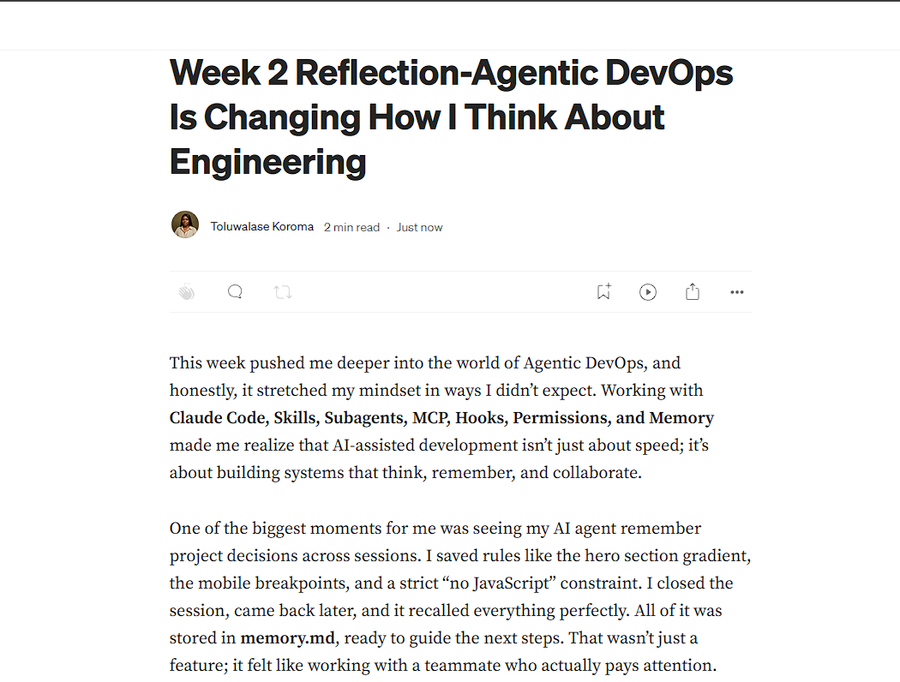
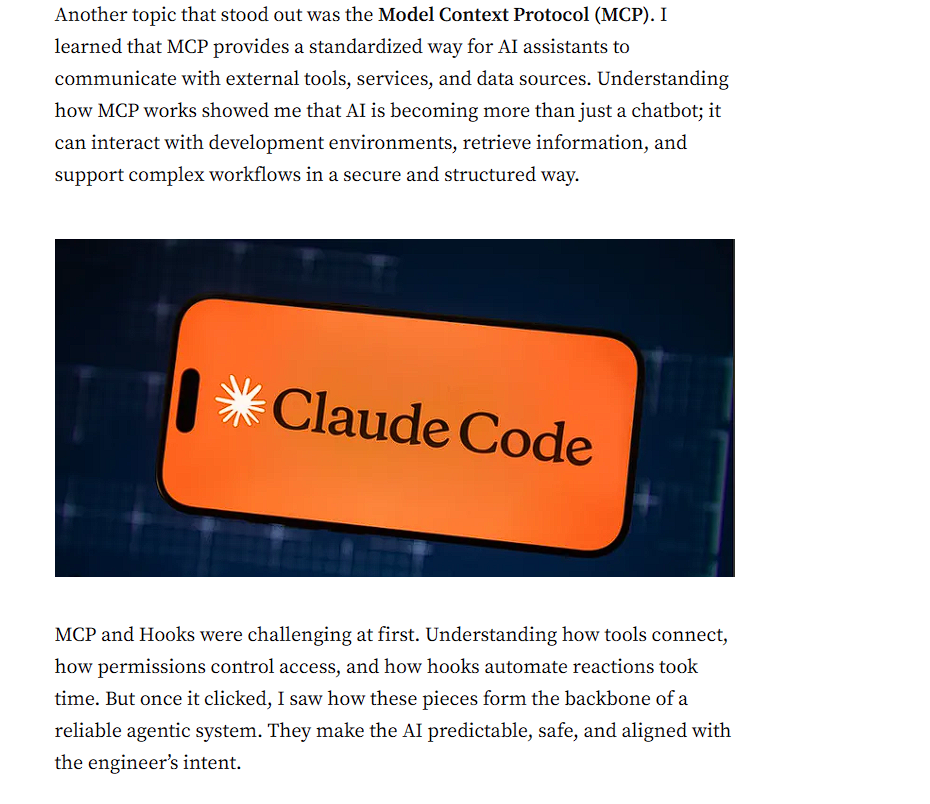
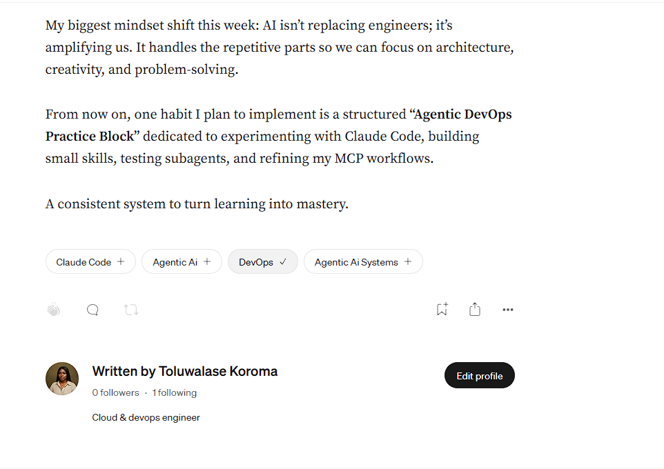
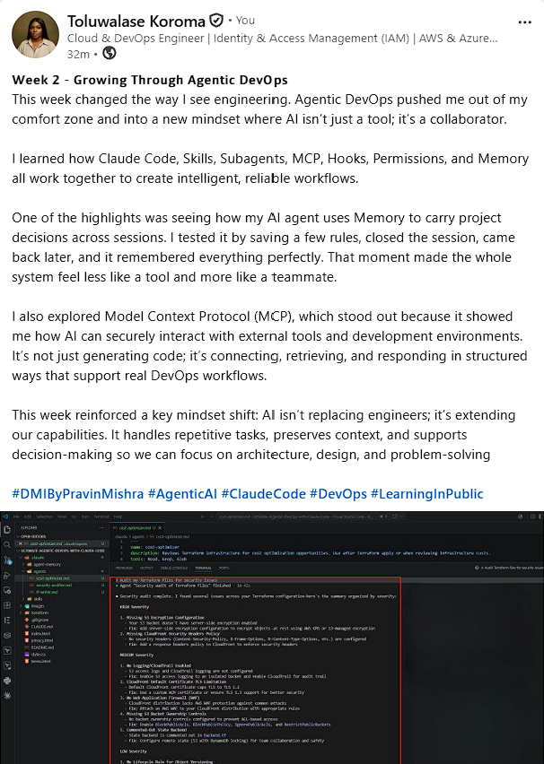

# Assignment 8 — Week 2 Reflection Blog

Part of the DevOps Micro Internship (DMI) Cohort 3 with Agentic AI

---

# Purpose

In this assignment, you will reflect on your Week 2 learning journey and write a short blog capturing your experience working with Agentic AI tools such as Claude Code, Skills, Subagents, MCP, Hooks, Permissions, and Memory.

You will also publish a LinkedIn post summarizing your learning and share both links for evaluation.

---

# Task 1 — Write Your Reflection Blog

## Goal

Write a reflection blog covering your Week 2 learning experience.

### Blog Requirements

Your blog must include:

* Title: **Reflection – Week 2**
* Minimum 300 words
* At least 2–3 topics from Week 2 (Claude Code, Skills, Subagents, MCP, Hooks, Permissions, Memory)
* Honest personal reflection (learning, challenges, mindset)
* One habit/system you plan to implement
* Your full name clearly visible

### Allowed Platforms

You can publish your blog on:

* Hashnode
* Medium
* Dev.to
* LinkedIn Article
* GitHub Markdown file
* Substack

---

### Evidence

#### Screenshot 1 — Blog published and visible







---

### Submission Field

Blog Link:

https://medium.com/@toluismine001/week-2-reflection-agentic-devops-is-changing-how-i-think-about-engineering-7ade189f148e

---

# Task 2 — Create LinkedIn Post

## Goal

Share your Week 2 learning publicly on LinkedIn.

---

### LinkedIn Post Requirements

Your post must include:

* One screenshot from any Week 2 assignment
* Short reflection (what you learned or built)
* Required P.S. line exactly as given below

---

### Required P.S. Line (Must Include Exactly)

> **P.S. This post is part of the DevOps Micro Internship (DMI) with Agentic AI — Cohort 3 — by [Pravin Mishra](https://www.linkedin.com/in/pravin-mishra-aws-trainer/). My graded progress is public: https://dmi.pravinmishra.com/s/YOUR-GITHUB-USERNAME.html · Start your DevOps journey: https://dmi.pravinmishra.com/?utm_source=student&utm_medium=ps-linkedin&utm_campaign=cohort3**

---

### Suggested Hashtags

#DMIByPravinMishra #AgenticAI #ClaudeCode #DevOps #LearningInPublic

---

### Evidence

#### Screenshot 2 — LinkedIn post published



---

### Submission Field

LinkedIn Post Content (copy-paste here):
𝗪𝗲𝗲𝗸 𝟮 - 𝗚𝗿𝗼𝘄𝗶𝗻𝗴 𝗧𝗵𝗿𝗼𝘂𝗴𝗵 𝗔𝗴𝗲𝗻𝘁𝗶𝗰 𝗗𝗲𝘃𝗢𝗽𝘀
This week changed the way I see engineering. Agentic DevOps pushed me out of my comfort zone and into a new mindset where AI isn’t just a tool; it’s a collaborator.

I learned how Claude Code, Skills, Subagents, MCP, Hooks, Permissions, and Memory all work together to create intelligent, reliable workflows.

One of the highlights was seeing how my AI agent uses Memory to carry project decisions across sessions. I tested it by saving a few rules, closed the session, came back later, and it remembered everything perfectly. That moment made the whole system feel less like a tool and more like a teammate.

I also explored Model Context Protocol (MCP), which stood out because it showed me how AI can securely interact with external tools and development environments. It’s not just generating code; it’s connecting, retrieving, and responding in structured ways that support real DevOps workflows.

This week reinforced a key mindset shift: AI isn’t replacing engineers; it’s extending our capabilities. It handles repetitive tasks, preserves context, and supports decision‑making so we can focus on architecture, design, and problem‑solving.

```
Paste your LinkedIn post content here
```

---

### LinkedIn Post Link:

https://www.linkedin.com/posts/toluwalase-koroma-9678b736a_dmibypravinmishra-agenticai-claudecode-share-7481300987559981056-9S-z/?utm_source=share&utm_medium=member_desktop&rcm=ACoAAFudL58B_KdACca6x5LqOifva91Ab5ggM3o

---

# Submission Instructions

* Blog must be publicly accessible
* LinkedIn post must be visible (public or unlisted where applicable)
* All required fields must be filled
* Screenshot proofs must be added to GitHub repository
* Do not include sensitive information in blog or post

---

# Completion Checklist

* [ ] Blog written with required structure
* [ ] Blog includes at least 2–3 Week 2 topics
* [ ] Blog is publicly accessible
* [ ] LinkedIn post created
* [ ] Required P.S. line included
* [ ] LinkedIn post content copied in submission field
* [ ] Blog link added
* [ ] LinkedIn post link added
* [ ] Screenshots added to GitHub repo

---

# About DMI & CloudAdvisory

DevOps Micro Internship (DMI) is a project-based DevOps program run by Pravin Mishra (The CloudAdvisory), focused on real-world execution, systems thinking, and agentic AI workflows.

It helps learners build strong DevOps foundations through hands-on experience.

---

# Resources

* 🌐 DMI Official Website: [https://pravinmishra.com/dmi](https://pravinmishra.com/dmi)
* 🎓 DevOps for Beginners (Udemy): [https://www.udemy.com/course/devops-for-beginners-docker-k8s-cloud-cicd-4-projects/](https://www.udemy.com/course/devops-for-beginners-docker-k8s-cloud-cicd-4-projects/)
* 🎓 Agentic AI DevOps with Claude Code: [https://www.udemy.com/course/ultimate-agentic-ai-devops-with-claude-code/](https://www.udemy.com/course/ultimate-agentic-ai-devops-with-claude-code/)
* 🎓 DevOps with Claude Code: Terraform, EKS, ArgoCD & Helm: [https://www.udemy.com/course/devops-with-claude-code-terraform-eks-argocd-helm/](https://www.udemy.com/course/devops-with-claude-code-terraform-eks-argocd-helm/)
* ▶️ YouTube Playlist: [https://www.youtube.com/playlist?list=PLFeSNDtI4Cho](https://www.youtube.com/playlist?list=PLFeSNDtI4Cho)
* 🔗 Pravin Mishra (LinkedIn): [https://www.linkedin.com/in/pravin-mishra-aws-trainer/](https://www.linkedin.com/in/pravin-mishra-aws-trainer/)
* 🏢 CloudAdvisory (LinkedIn): [https://www.linkedin.com/company/thecloudadvisory/](https://www.linkedin.com/company/thecloudadvisory/)

