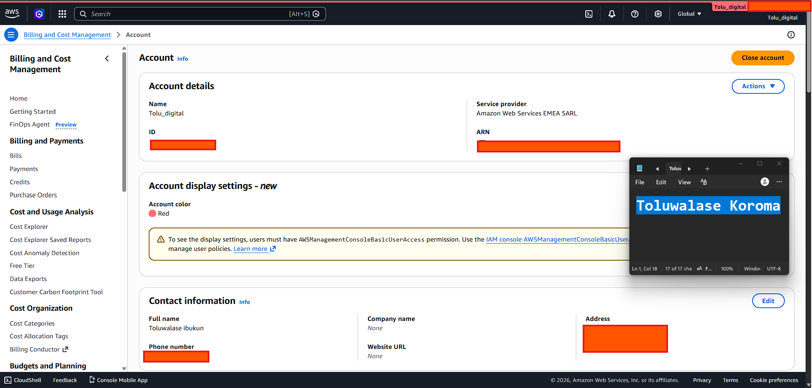

# Assignment 1 — AWS Free Tier Account Setup (EpicReads Cloud Onboarding)

Part of the DevOps Micro Internship (DMI) Cohort 3 with Agentic AI

---

## Purpose

In this assignment, you will create and verify an AWS Free Tier account as part of onboarding EpicReads — an online bookstore moving to the cloud. You will demonstrate an understanding of AWS fundamentals, Free Tier services, and account setup by answering conceptual questions and capturing proof of a working AWS Console login.

---

# Task 1 — Understanding AWS & Free Tier

## Goal

Demonstrate understanding of AWS basics and Free Tier usage by answering the following questions in your own words (3–4 lines each).

### Answers

#### Question 1 — What is an AWS account, and why do you need it at this stage?

An AWS account is simply an identity and workspace inside Amazon Web Services. It holds the billing details, security settings, and every cloud resource I create.

At this stage, an AWS account is needed because it unlocks the Free Tier, allows me access AWS services, enables hands‑on labs for learning, and provides a clean environment for my DevOps and cloud practice.

---

#### Question 2 — What is AWS Free Tier, and how long does it last?

The AWS Free Tier lets new customers explore AWS services at no cost. It provides up to $200 in credits — $100 at sign‑up and up to $100 more as you use foundational services. The Free Tier lasts up to 6 months, depending on how quickly the credits are used.

AWS also offers 30+ Always Free services, which remain free indefinitely as long as one stay within their monthly usage limits.

---

#### Question 3 — Name three AWS Free Tier services and their free usage limits.

Three clear AWS Free Tier services and their usage limits:

- AWS Lambda — 1 million requests per month + 400,000 GB‑seconds of compute 

- Amazon DynamoDB — 25 GB storage + 25 read capacity units + 25 write capacity units per month 

- Amazon S3 — 5 GB standard storage, 20,000 GET requests, 2,000 PUT requests per month (12‑month Free Tier) 

---

# Task 2 — Create AWS Free Tier Account

## Goal

Create a valid AWS Free Tier account and sign in to the AWS Management Console.

> No screenshots required for this task. Completion is verified through Task 3.

---

# Task 3 — Verify AWS Account

## Goal

Confirm that your AWS account setup is complete by navigating to the Account section and capturing proof.

### Evidence

#### Screenshot 1 — AWS Account page showing account name (email may be blurred)

---

# Submission Instructions

- Add all required screenshots in your GitHub repository submission
- Full name must be visible in required screenshots
- Do not expose sensitive information (keys, passwords, account IDs)

---

# Completion Checklist

- [ ] Task 1 answers written in own words
- [ ] AWS Free Tier account created successfully
- [ ] Signed in to AWS Management Console
- [ ] Screenshot of AWS Account page captured (full name visible, no sensitive data)
- [ ] All required screenshots added to repository

---

## 📌 About DMI & CloudAdvisory

DevOps Micro Internship (DMI) is a project-based DevOps program run by Pravin Mishra (The CloudAdvisory) focused on real-world execution, systems thinking, and career readiness.

It helps learners build strong DevOps foundations with hands-on experience.

---

## 📌 Resources

- 🌐 DMI Official Website: https://pravinmishra.com/dmi  
- 🎓 DevOps for Beginners (Udemy): https://www.udemy.com/course/devops-for-beginners-docker-k8s-cloud-cicd-4-projects/  
- 🎓 Agentic AI DevOps with Claude Code: https://www.udemy.com/course/ultimate-agentic-ai-devops-with-claude-code/  
- 🎓 DevOps with Claude Code: Terraform, EKS, ArgoCD & Helm: https://www.udemy.com/course/devops-with-claude-code-terraform-eks-argocd-helm/  
- ▶️ YouTube Playlist: https://www.youtube.com/playlist?list=PLFeSNDtI4Cho  
- 🔗 Pravin Mishra (LinkedIn): https://www.linkedin.com/in/pravin-mishra-aws-trainer/  
- 🏢 CloudAdvisory (LinkedIn): https://www.linkedin.com/company/thecloudadvisory/

---

*This submission is part of DevOps Micro Internship (DMI) Cohort 3 — Agentic AI Track.*