# Assignment 3 — Production Maintenance Drill (OPS Checklist)

Part of the DevOps Micro Internship (DMI) Cohort 3 with Agentic AI

---

## Purpose

In this assignment, you will treat your already deployed React application (on Ubuntu VM with Nginx) as a live production system. You will perform structured operational checks covering network validation, service health, log analysis, resource monitoring, configuration verification, and incident simulation with recovery — mirroring real on-call DevOps responsibilities.

---

# Task 1 — Server Access & Networking Validation

## Goal

Verify that the deployed React application is reachable from the browser and confirm basic network connectivity of the Ubuntu VM.

### Evidence

#### Screenshot 1 — Browser showing the React app with your Full Name visible on the UI

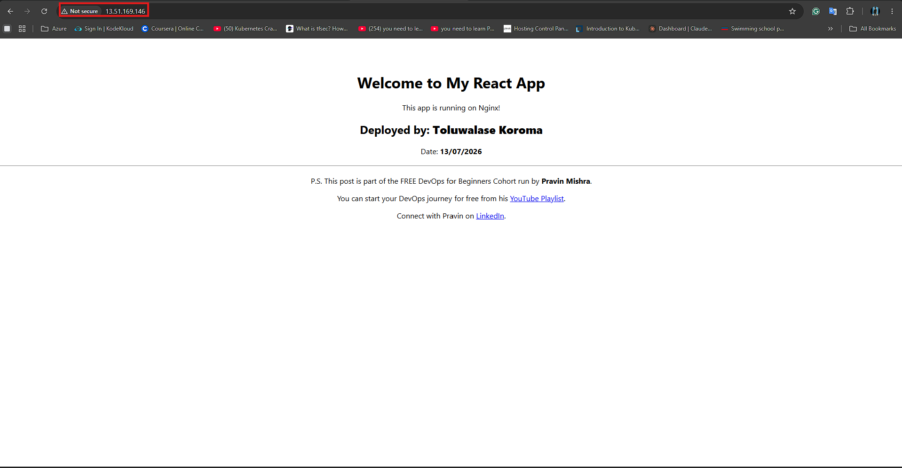

---

#### Screenshot 2 — Output of `ip a`

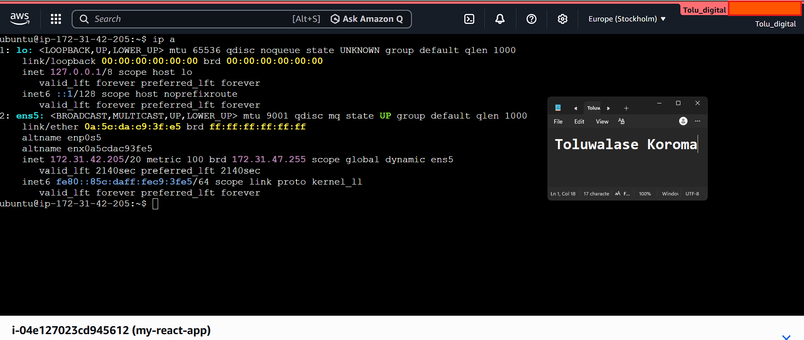

---

#### Screenshot 3 — Output of `sudo ss -tulpen`

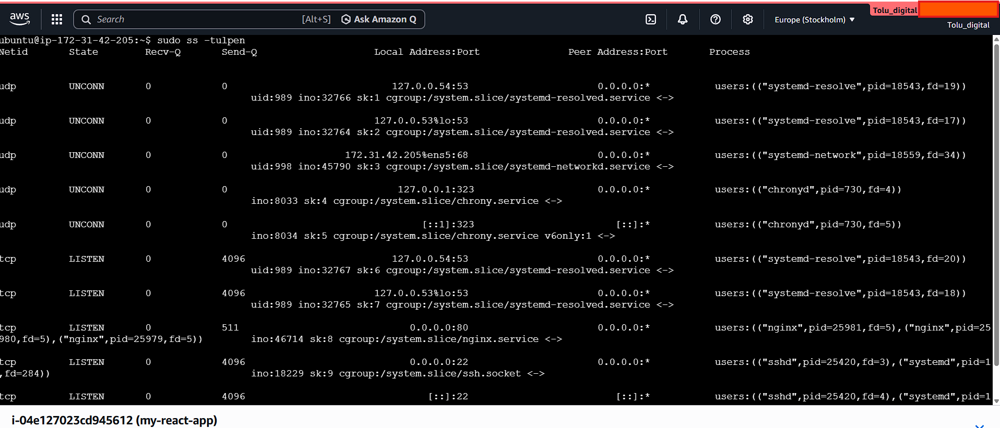

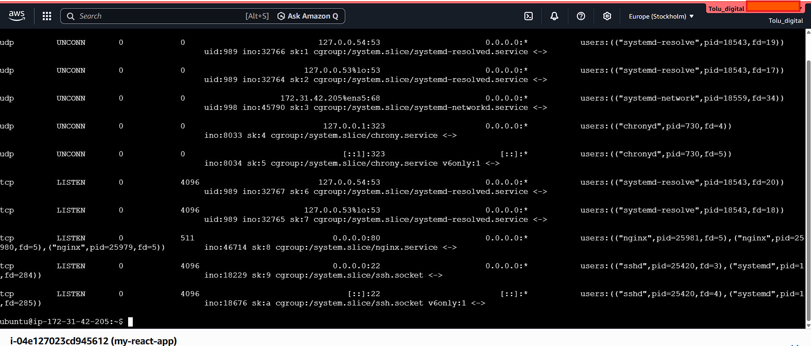

---

#### Screenshot 4 — Output of `sudo ufw status`

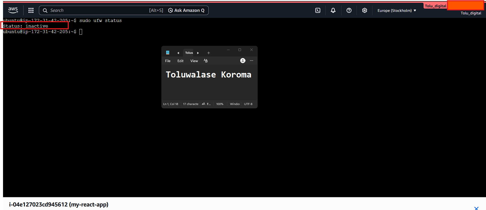

---

### Notes

Answer the following in your own words:

**1. What proves Nginx is listening on 0.0.0.0:80?**

The line showing LISTEN ... 0.0.0.0:80 ("nginx",pid=25979) proves Nginx is actively listening for HTTP requests on all IPv4 interfaces.

---

**2. What proves SSH is active on port 22?**

The entries LISTEN ... 0.0.0.0:22 and [::]:22 confirm the SSH service is running and accepting connections on port 22 for both IPv4 and IPv6.
 
---

**3. Did you find any unexpected open ports? Explain briefly.**

None found — all open ports (53, 68, 323, 80, 22) belong to normal system services like DNS, DHCP, NTP, Nginx, and SSH.

---

# Task 2 — Service Health & Systemd Validation (Nginx)

## Goal

Verify that Nginx is properly installed, running, enabled at boot, and safely configured.

### Evidence

#### Screenshot 1 — Output of `systemctl status nginx --no-pager`

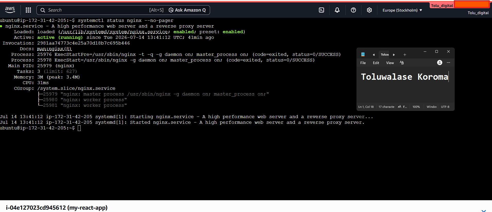

---

#### Screenshot 2 — Output of `sudo nginx -t`

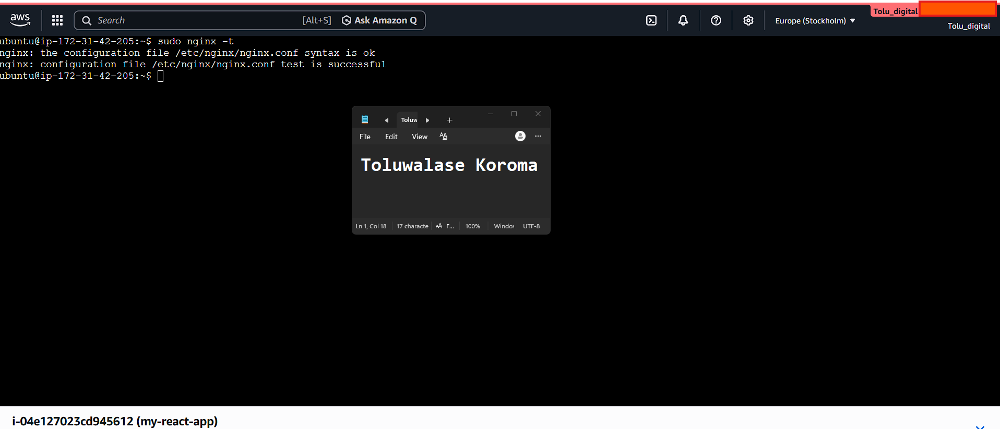

---

#### Screenshot 3 — Output of `sudo ss -lptn '( sport = :80 )'`

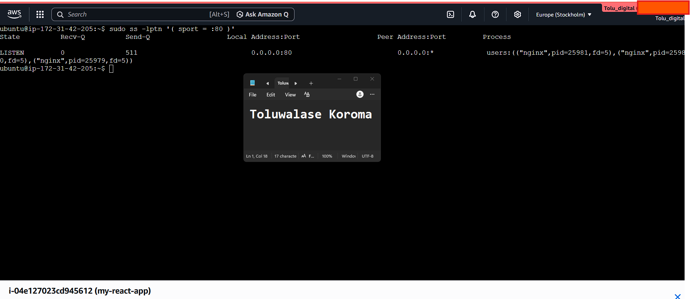

---

### Notes

Answer the following in your own words:

**1. What happens if Nginx fails to restart in production?**

If Nginx fails to restart, the production server stops serving traffic. Users will see downtime because the web server is no longer responding to requests.

---

**2. What's your basic rollback plan?**

If Nginx fails to restart, I just have to switch back to the last working config and restart it again.
If that still doesn’t fix things, I roll back to my previous deployment or backup so the site comes back online quickly.

---

# Task 3 — Logs & Request Trace

## Goal

Verify real traffic flow and analyze logs to understand system behavior and errors.

### Evidence

#### Screenshot 1 — Output of `sudo tail -n 30 /var/log/nginx/access.log`

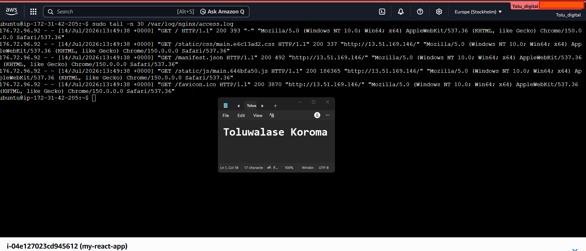

---

#### Screenshot 2 — Output of `sudo tail -n 30 /var/log/nginx/error.log`

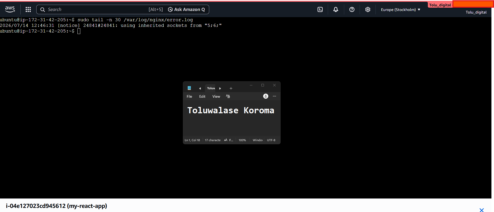

---

#### Screenshot 3 — Output of `sudo journalctl -u nginx --no-pager -n 50`

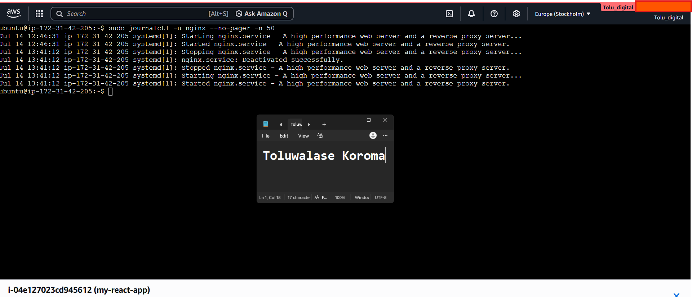

---

### Notes

Answer the following in your own words:

**1. Were there any errors in the logs?**

- If yes, mention 1–2 example error lines from the logs and explain what each one means in simple terms.
- If no, explain what it means if the error log is empty or shows no recent errors during your check.

No errors. The error log shows only: [notice] using inherited sockets from "5;6;"
That’s not an error; it’s a normal message meaning Nginx reused existing network sockets during a restart. If the error log is empty or shows no recent errors, it means Nginx hasn’t encountered any recent problems.

---

**2. If there were no errors, what does that indicate about the system?**

It means the web server is healthy. Nginx is running smoothly, serving requests, and not reporting configuration or runtime issues.

---

**3. Based on the access logs, were your curl requests visible in the log entries? What does that prove about traffic flow?**

Yes. The access log shows several successful GET requests (status 200) from the IP.
That proves traffic is reaching Nginx correctly and responses are being sent back, confirming that your network and server routing are working as expected..

---

# Task 4 — System Resource Health Check (Capacity Red Flags)

## Goal

Assess server capacity and detect potential performance or failure risks.

### Evidence

#### Screenshot 1 — Output of `uptime`

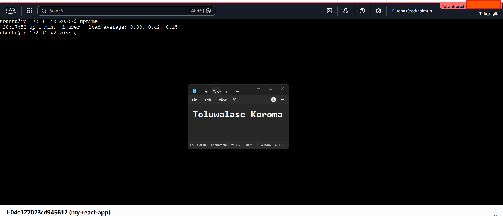

---

#### Screenshot 2 — Output of `free -h`

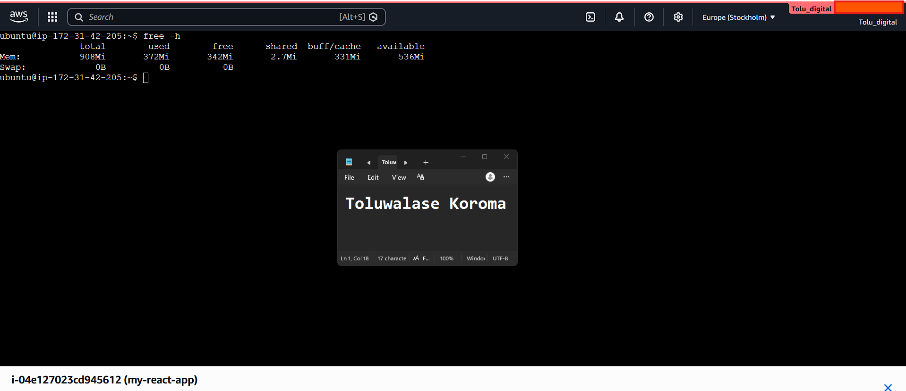

---

#### Screenshot 3 — Output of `df -h`

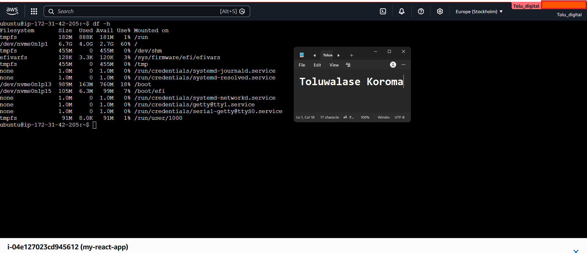

---

#### Screenshot 4 — Output of `sudo du -sh /var/* | sort -h`

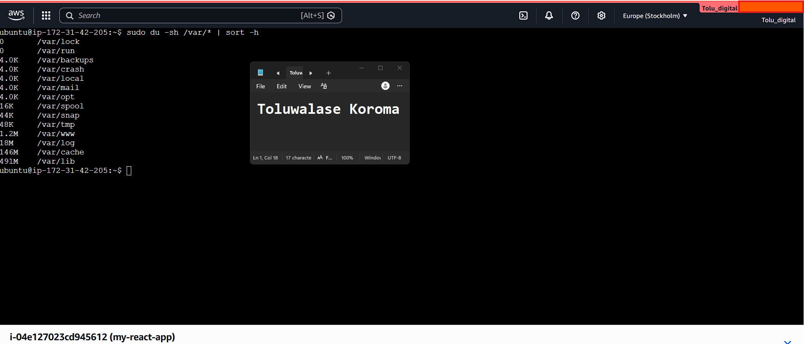

---

### Notes

Answer the following in your own words:

**1. Which resource looks most critical right now? (CPU/load, memory, or disk) Explain why.**

The disk is the most critical resource. The main partition /dev/nvme0n1p1 is 61% full, while memory and CPU load are very light (only 366 MiB used out of 908 MiB RAM, and load average ≈ 0.1). That means the server isn’t under CPU or memory pressure, but disk usage is climbing and should be monitored.

---

**2. What happens if disk becomes 100% full in a production server?**

If the disk reaches 100 % usage:

- Nginx and other services can’t write logs or cache files.

- Databases and apps fail to save data.

- The system may freeze or refuse new connections.

- The OS may freeze or reject SSH logins.

In short, a full disk causes downtime and data loss risk. It is important to always keep at least 10–20 % free space for safe operation.

---

# Task 5 — Configuration & Deployment Verification

## Goal

Ensure the correct React build is deployed and Nginx is serving it properly.

### Evidence

#### Screenshot 1 — Output of `ls -lah /var/www/html | head -n 20`

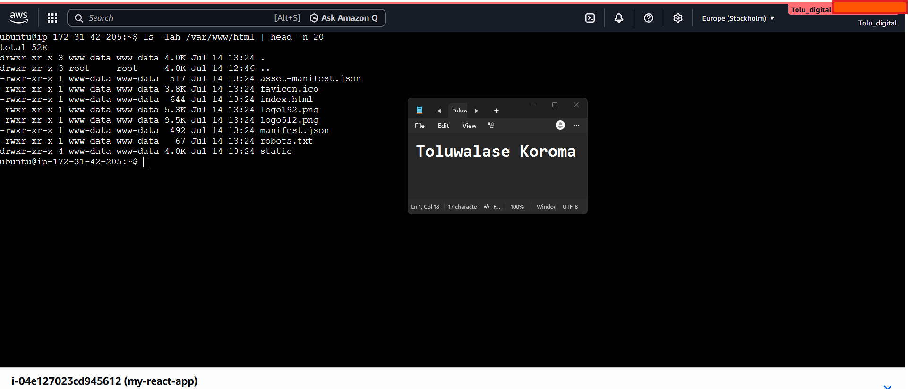.

---

#### Screenshot 2 — Output of `grep -R "Deployed by" -n /var/www/html 2>/dev/null | head`

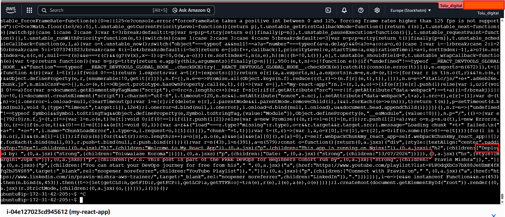

---

#### Screenshot 3 — Output of `grep -n "try_files" /etc/nginx/sites-available/default`

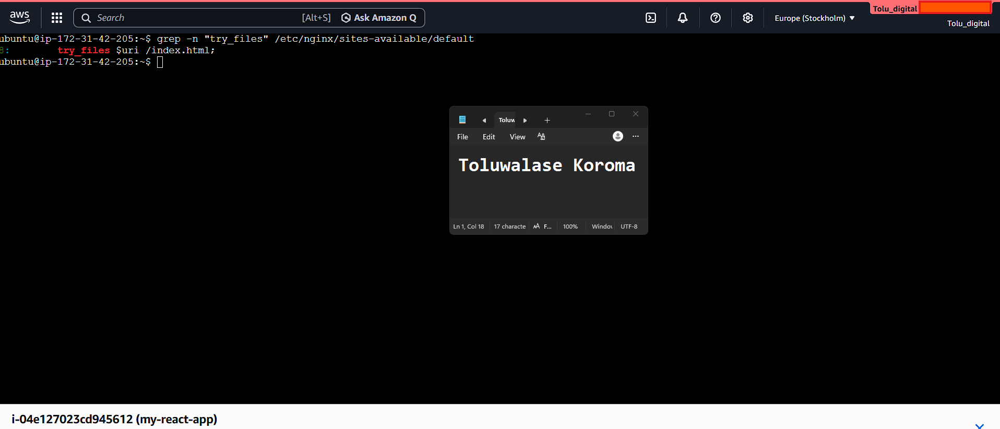

---

### Notes

Answer the following in your own words:

**1. How do you confirm that the correct version of the application is deployed?**

- I checked the files in **/var/www/html** using ls -lah
I listed the contents of the web root directory to make sure the deployment actually placed files in the correct location.This confirmed that the directory contains the expected production build files.

- I confirmed the React build files are present. 
Inside /var/www/html, I verified that the typical React production build structure exists:
  - index.html
  - asset-manifest.json
  - favicon.ico
  - logo192.png, logo512.png
  - static/ folder 

This proves that the React build was successfully generated and deployed.

- I verified my custom change is deployed by checking the "Deployed by <Toluwalase Koroma>" line in the code

- I ensured Nginx is serving the correct application. I checked the Nginx configuration and confirmed that the web root is correctly set to:
**root /var/www/html**;
 This means Nginx is serving the exact files I inspected. I also verified that Nginx is listening on port 80, proving the server is actively serving the application.

- I validated that the application loads correctly in the browser.
Finally, I opened the public IP address in the browser and confirmed that the React application loads without errors.
This proves that:
  - The deployment is correct
  - Nginx is serving the right files
  - The application is functioning as expected

---

# Task 6 — Nginx Configuration Failure Simulation

## Goal

Simulate a real-world Nginx misconfiguration and recover the service safely.

### Evidence

#### Screenshot 1 — Output of `sudo nginx -t` showing the syntax error (broken config)

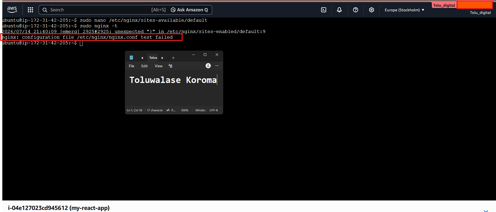

---

#### Screenshot 2 — Output of `sudo nginx -t` showing syntax ok (fixed config)

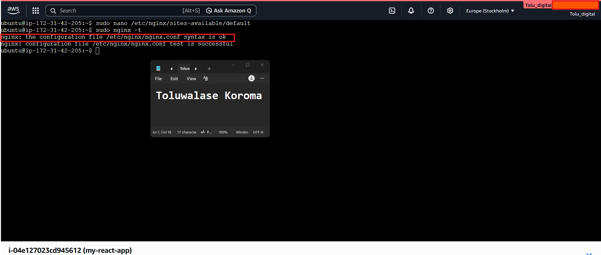

---

#### Screenshot 3 — Output of `curl -I http://<public-ip>` confirming recovery (200 OK)

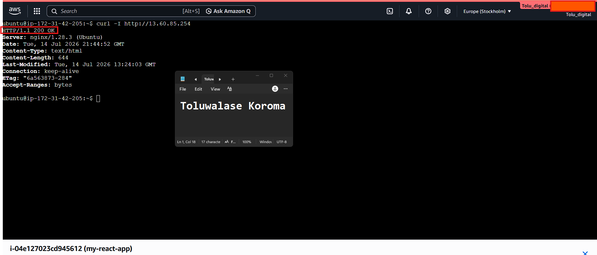

---

### Notes

Answer the following in your own words:

**1. What caused the configuration failure?**

The failure happened because I removed the semicolon **;** from this line **try_files $uri /index.html;**. Without the semicolon, the Nginx configuration became invalid.
Nginx requires semicolons to mark the end of each directive, so removing it caused the entire config test to fail.

---

**2. How did you fix the issue?**

I fixed the problem by adding the missing semicolon back to the line.Once the semicolon was restored, the configuration became valid again and Nginx restarted successfully
.

---

**3. How can you avoid this kind of issue in real production systems?**

I avoid issues like missing semicolons by using:

 - Nginx -t before reload

 - CI/CD pipelines

 - Git version control

 - Staging environments

 - No manual edits in production

 - Automated config management tools

These steps make sure bad configs never reach production and prevent downtime.

---

# Task 7 — Web Application Failure Simulation

## Goal

Simulate missing deployment content and recover the application safely.

### Evidence

#### Screenshot 1 — Output of `curl -I http://<public-ip>` showing failure (non-200 response)

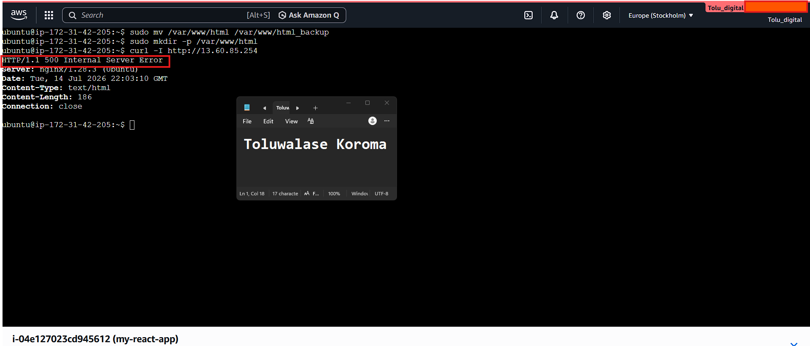

---

#### Screenshot 2 — Output of `curl -I http://<public-ip>` confirming recovery (200 OK)

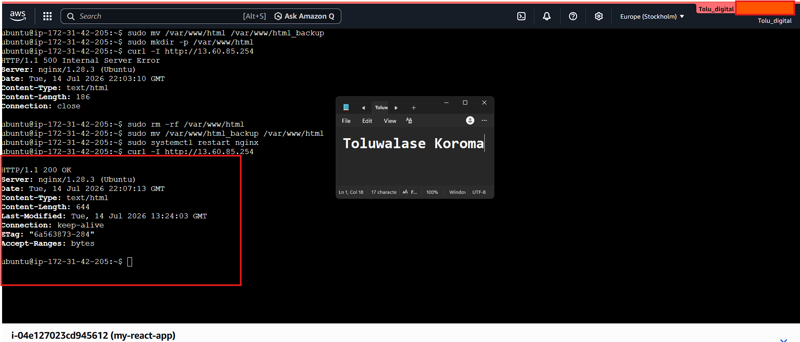

---

### Notes

Answer the following in your own words:

**1. What caused the application to break in this scenario?**
I moved the Nginx web directory **/var/www/html** into the backup folder and created a new empty directory in its place.Because Nginx was still pointing to **/var/www/html**, which no longer contained the application files, the server returned a 500 Internal Server Error when accessed.
The issue occurred because the web root directory was empty and misconfigured.

---

**2. How did you fix the issue and restore the application?**
I fixed the issue by deleting the new empty Nginx web directory I had created and restoring the original directory from the backup. 
Specifically, I removed **/var/www/html**, moved **/var/www/html_backup back** to **/var/www/html**, and then restarted Nginx. After restoring the correct web root and restarting Nginx, I verified the fix with: curl -I http://13.60.85.254. The server returned **HTTP/1.1 200 OK**, confirming that Nginx was now serving the correct application files and the site was functioning properly again.

---

**3. What steps would you take to prevent this kind of issue in real production systems?**

Steps for prevention real production systems:
 - Automation (CI/CD + validation)
 - Version control (Git)
 - Staging and backups
 - Access control and monitoring

These practices make production systems resilient, predictable, and secure, so a simple directory move never takes down the app again.

---

# Task 8 — Security & Reliability Review

## Goal

Review and reflect on the security and reliability practices applied during this assignment.

### Security & Reliability Notes

Answer the following in your own words:

**1. Why is SSH key-based authentication more secure than sharing passwords?**

SSH keys are much harder to crack than passwords because they use long cryptographic key pairs instead of human‑typed secrets. Keys cannot be guessed, reused, or brute‑forced easily. They also prevent password‑sharing, reduce human error, and protect against credential theft.

---

**2. Why should only required ports be open on a production server?**

Every open port is a potential entry point for attackers. Closing all unnecessary ports reduces the attack surface, prevents unauthorized access, and ensures only essential services (like Nginx on port 80/443) are reachable. This improves security and stability.

---

**3. Why is it important for Nginx to be enabled on boot?**

If Nginx is enabled on boot, the web application automatically starts whenever the server restarts. This ensures uptime, prevents outages after reboots, and guarantees the application is always available without manual intervention.

---

**4. What are the risks of sharing secrets, keys, or credentials publicly?**

Sharing secrets publicly can lead to full system compromise. Attackers can access servers, databases, cloud accounts, and APIs. This can cause data breaches, financial loss, service downtime, and permanent security damage. Secrets must always be kept private.

---

**5. Why should cloud resources be stopped or terminated when they are no longer needed?**

Unused cloud resources continue to generate costs. Stopping or terminating them prevents unnecessary billing, reduces waste, and keeps your cloud environment clean and secure. It also avoids accidental exposure of forgotten services.

---

# LinkedIn Post (Required)

## Evidence

#### LinkedIn Post URL

Paste your LinkedIn post URL here:

`Add your URL here`

---

#### Screenshot — Published LinkedIn post

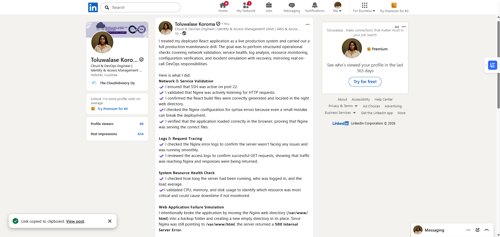

---

# Submission Instructions

- Add all required screenshots in your submission
- Full name must be visible in required screenshots
- Do not expose sensitive information (keys, passwords, account IDs)

---

# Completion Checklist

- [ ] Task 1: Screenshots (browser, ip a, ss -tulpen, ufw status) + Notes answered
- [ ] Task 2: Screenshots (nginx status, nginx -t, ss port 80) + Notes answered
- [ ] Task 3: Screenshots (access log, error log, journalctl) + Notes answered
- [ ] Task 4: Screenshots (uptime, free -h, df -h, du -sh) + Notes answered
- [ ] Task 5: Screenshots (ls html, grep deployed by, grep try_files) + Notes answered
- [ ] Task 6: Screenshots (nginx -t fail, nginx -t pass, curl recovery) + Notes answered
- [ ] Task 7: Screenshots (curl failure, curl recovery) + Notes answered
- [ ] Task 8: Security & Reliability Notes answered
- [ ] LinkedIn post published and URL submitted
- [ ] Full Name visible in all required screenshots
- [ ] No sensitive data exposed

---

## 📌 About DMI & CloudAdvisory

DevOps Micro Internship (DMI) is a project-based DevOps program run by Pravin Mishra (The CloudAdvisory) focused on real-world execution, systems thinking, and career readiness.

It helps learners build strong DevOps foundations with hands-on experience.

---

## 📌 Resources

- 🌐 DMI Official Website: https://pravinmishra.com/dmi  
- 🎓 DevOps for Beginners (Udemy): https://www.udemy.com/course/devops-for-beginners-docker-k8s-cloud-cicd-4-projects/  
- 🎓 Agentic AI DevOps with Claude Code: https://www.udemy.com/course/ultimate-agentic-ai-devops-with-claude-code/  
- 🎓 DevOps with Claude Code: Terraform, EKS, ArgoCD & Helm: https://www.udemy.com/course/devops-with-claude-code-terraform-eks-argocd-helm/  
- ▶️ YouTube Playlist: https://www.youtube.com/playlist?list=PLFeSNDtI4Cho  
- 🔗 Pravin Mishra (LinkedIn): https://www.linkedin.com/in/pravin-mishra-aws-trainer/  
- 🏢 CloudAdvisory (LinkedIn): https://www.linkedin.com/company/thecloudadvisory/

---

*This submission is part of DevOps Micro Internship (DMI) Cohort 3 — Agentic AI Track.*