# Assignment 5 — Bash Script Automation Drill (OPS Checklist)

Part of the DevOps Micro Internship (DMI) Cohort 3 with Agentic AI

---

## Purpose

In this assignment, you will practice Bash scripting by building a series of small automation scripts covering environment setup, variables, arrays, loops, file conditionals, if-else logic, and functions. These scripts form the foundation of real-world Linux automation used in DevOps, cloud, and production support environments.

---

# Task 1 — Bash Environment & Workspace Setup

## Goal

Verify that Bash is available on your system and create a clean workspace for this assignment.

### Evidence

#### Screenshot 1 — Output of `echo $SHELL` and `bash --version`

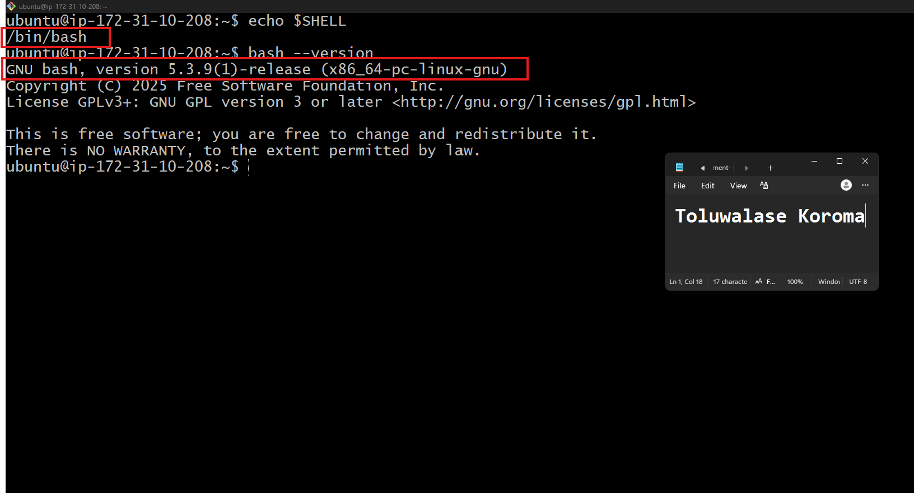

---

#### Screenshot 2 — Output of `pwd` and `ls -lah` showing the scripts directory

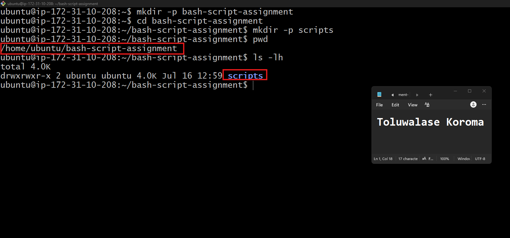

---

### Notes

Answer the following in your own words:

**1. What is Bash?**

Bash (Bourne Again Shell) is a command‑line interpreter used on Linux and Unix systems. It allows you to run commands, automate tasks, and write scripts that control the system. It’s one of the most common shells used for scripting and server administration.

---

**2. What is the difference between shell and Bash?**

A shell is the general term for any command‑line interface that lets you interact with the operating system.Bash is one specific type of shell.

So:
- Shell = category (many types exist: sh, Bash, Zsh, Fish, etc.)
- Bash = one implementation of a shell, widely used for scripting and automation

---

**3. Why is it important to confirm the Bash version before writing scripts?**

Different Bash versions support different features and syntax.If a script uses features from a newer version, it may break on systems running an older version.
Confirming the Bash version ensures the script runs correctly, avoids compatibility issues, and prevents unexpected errors in production.

---

# Task 2 — Your First Bash Script

## Goal

Create your first Bash script, make it executable, and run it from the terminal.

### Evidence

#### Screenshot 1 — Content of `first-script.sh`

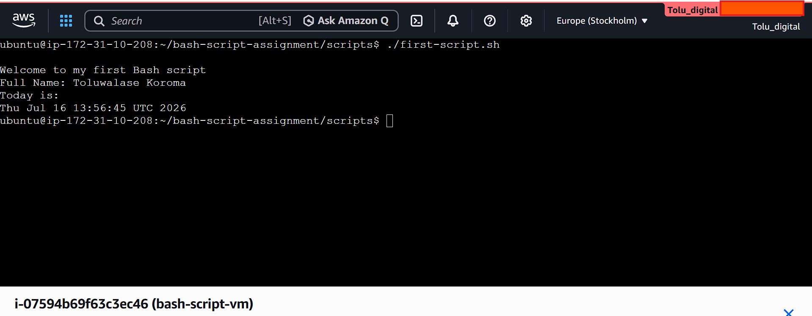

---

#### Screenshot 2 — Output of `./first-script.sh`

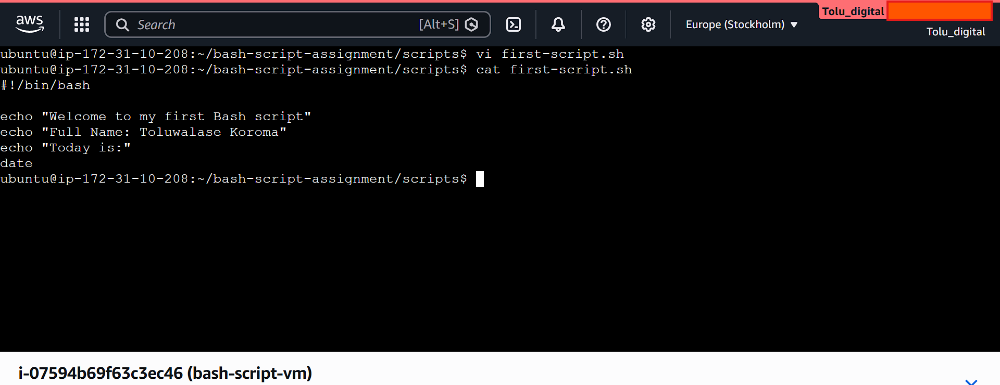

---

#### Screenshot 3 — Output of `ls -l first-script.sh` showing executable permission

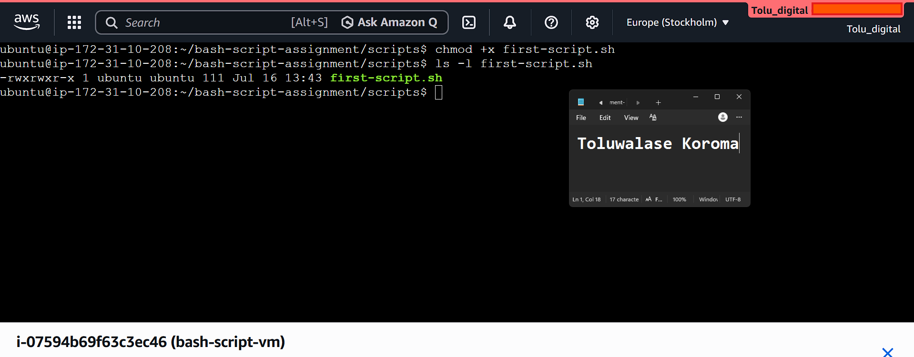

---

### Notes

Answer the following in your own words:

**1. What is the purpose of `#!/bin/bash`?**

**#!/bin/bash** is called a shebang. Its purpose is to tell the system which interpreter should run the script.When the script starts, the shebang ensures it is executed using Bash instead of another shell.

---

**2. Why do we use `chmod +x` before running a script?**

**chmod +x** makes the script executable. Without this permission, the system won’t allow you to run the file directly.Adding execute permission lets it run like a program.

---

**3. What is the difference between running a script using `./script.sh` and `bash script.sh`?**

**./script.sh**

 -Runs the script as an executable file

 - Uses the interpreter defined in the shebang (#!/bin/bash)

 - Requires chmod +x

**bash script.sh**

 - Runs the script through the Bash interpreter directly

 - Ignores the shebang

 - Does not require execute permission

---

# Task 3 — Variables: User Information Script

## Goal

Use variables to store and display user-related information.

### Evidence

#### Screenshot 1 — Content of `user-info.sh`

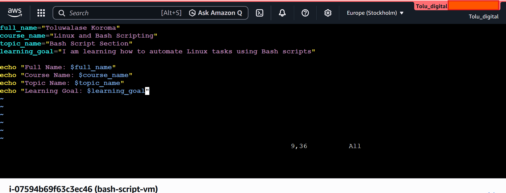

---

#### Screenshot 2 — Output of `./user-info.sh`

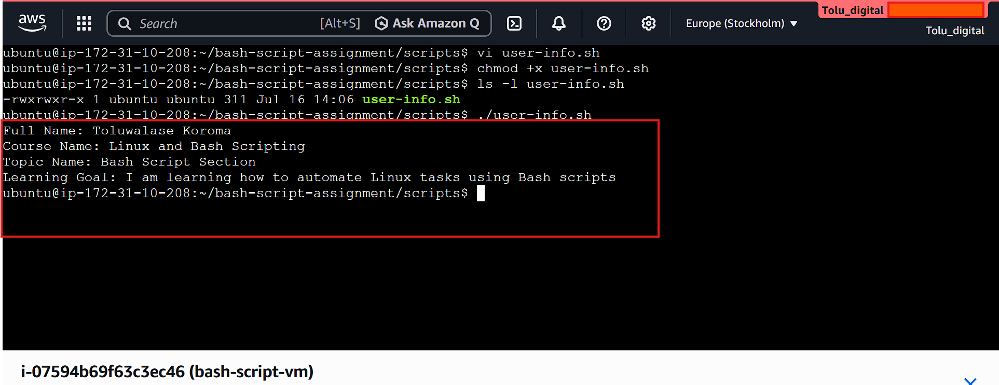

---

### Notes

Answer the following in your own words:

**1. What is a variable in Bash?**

Add your answer here.
A variable in Bash is a placeholder used to store a value such as text, numbers, or command output. Data saved in a variable can be reused later in the script.

**2. Why should we avoid spaces around the `=` sign when creating variables?**

Bash does not allow spaces around the **=** sign.
When spaces are added, Bash will treat the variable name or value as separate commands, which causes an error.

---

**3. How do you access the value stored inside a Bash variable?**

A variable is accessed by adding a $ before its name.This prints the value stored inside the variable.

---

# Task 4 — Arrays & Loops: Tools Checklist Script

## Goal

Use arrays and loops to print a checklist of tools used in Bash scripting.

### Evidence

#### Screenshot 1 — Content of `tools-checklist.sh`

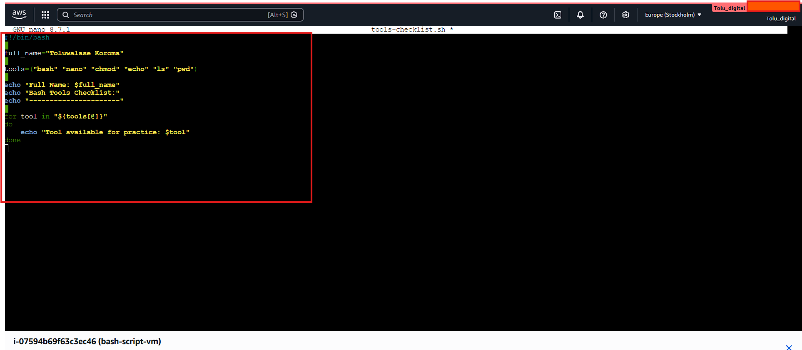

---

#### Screenshot 2 — Output of `./tools-checklist.sh`

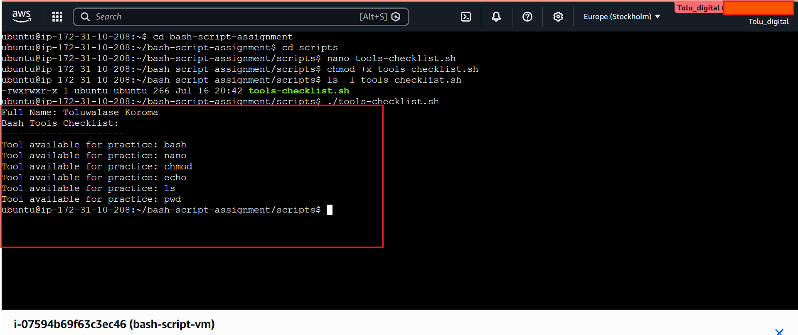

---

### Notes

Answer the following in your own words:

**1. What is an array in Bash?**

An array in Bash is a variable that can store multiple values under one name. Each value is stored at an index, and you can access them individually or all at once.

---

**2. Why are arrays useful in scripts?**

“Arrays help organize multiple items under one variable, making it easier to run repeated actions without writing many separate commands.”

---

**3. What does `"${tools[@]}"` mean?**

**“${tools[@]}"** expands to all elements stored in the tools array. It is used when a script needs to handle each value individually, such as during iteration or when passing multiple arguments while keeping every element separate.”

---

**4. What is the purpose of the `for` loop in this script?**

The **for** loop iterates through each element in the array and performs a defined action for every item, enabling repeated operations without duplicating code.

---

# Task 5 — Loops: Number Counter Script

## Goal

Use loops to repeat a task multiple times.

### Evidence

#### Screenshot 1 — Content of `counter.sh`

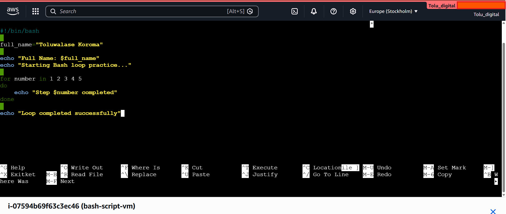

---

#### Screenshot 2 — Output of `./counter.sh`

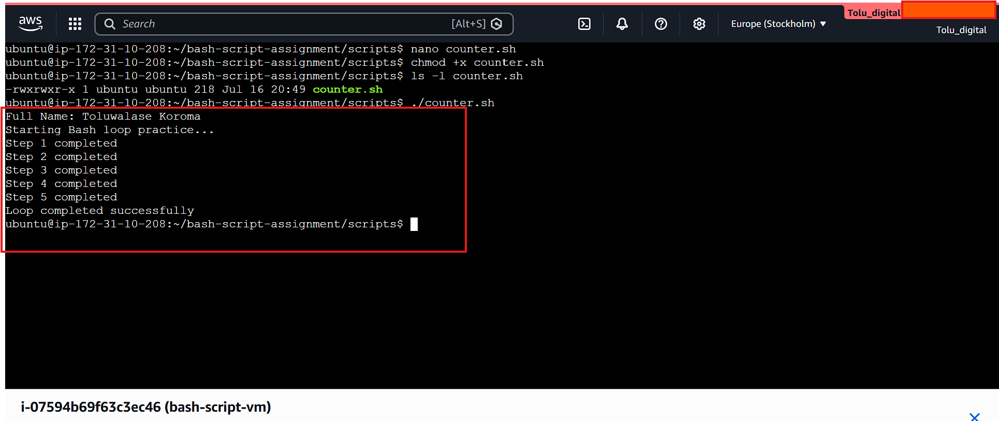

---

### Notes

Answer the following in your own words:

**1. What is a loop?**

A loop is a control structure that repeats a block of code multiple times until a specific condition is met or a defined sequence is completed.

---

**2. Why do we use loops in Bash scripting?**

Loops are used to automate repetitive tasks, reduce manual effort, and execute the same set of commands for multiple items or a defined number of iterations.

---

**3. How many times did the loop run in your script?**

The loop ran the same number of times as the number of elements in the array used within the script.

---

**4. What would you change if you wanted the loop to run 10 times?**

The loop’s range or the array content would be modified to include 10 items, or a numeric loop such as for i in {1..10} would be used to ensure exactly 10 iterations.

---

# Task 6 — Files & Conditionals: File Validation Script

## Goal

Use file checks and conditionals to verify whether files and directories exist.

### Evidence

#### Screenshot 1 — Output of `ls -lah ../test-folder`

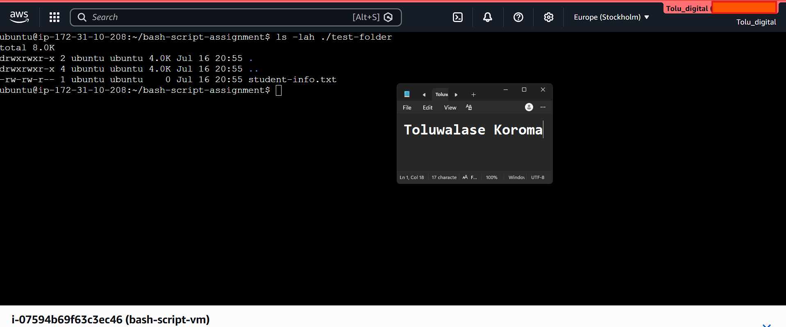

---

#### Screenshot 2 — Content of `file-check.sh`

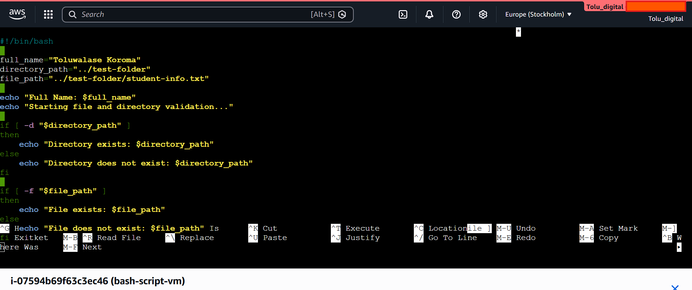

---

#### Screenshot 3 — Output of `./file-check.sh`

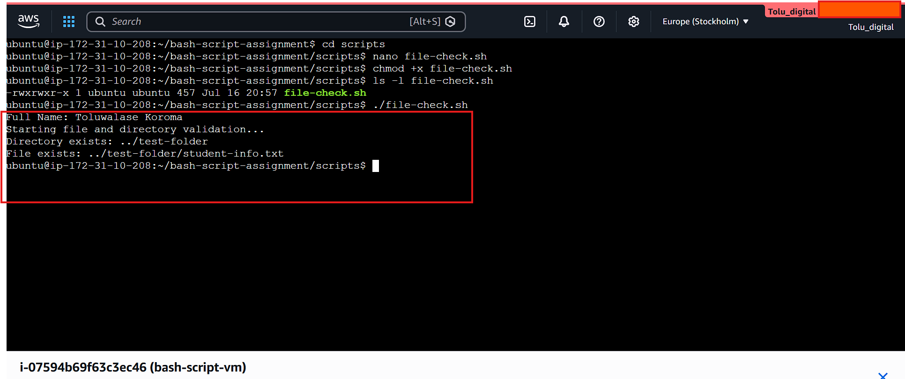

---

### Notes

Answer the following in your own words:

**1. What does `-d` check in Bash?**

The **-d** flag checks whether a given path refers to an existing directory.

---

**2. What does `-f` check in Bash?**

The **-f** flag checks whether a given path refers to an existing regular file.

---

**3. Why should file and directory paths be stored in variables?**

Storing paths in variables improves readability, reduces repetition, and makes scripts easier to maintain. It also allows paths to be updated in one place without modifying multiple lines of code.

---

**4. What happens if the file does not exist?**

If the file does not exist, the condition using **-f** evaluates as false, and the script executes the alternative branch, often displaying an error message or skipping the related operation.

---

# Task 7 — Conditionals: Pass or Retry Script

## Goal

Use if-else conditionals to make decisions based on a variable value.

### Evidence

#### Screenshot 1 — Content of `score-check.sh` with `score=85`

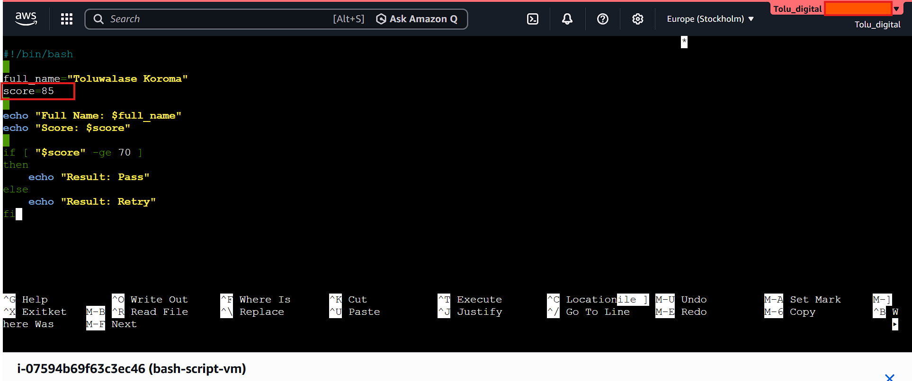

---

#### Screenshot 2 — Output showing `Result: Pass`

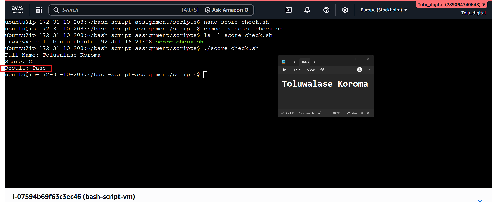

---

#### Screenshot 3 — Content of `score-check.sh` with `score=55`

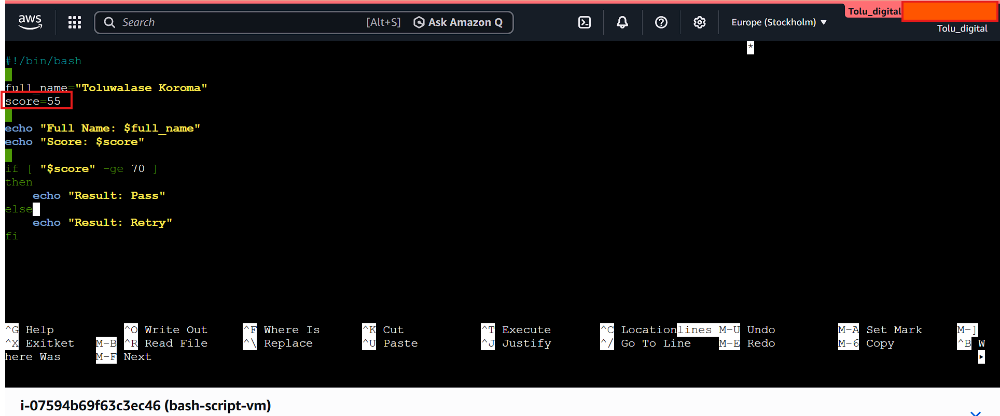

---

#### Screenshot 4 — Output showing `Result: Retry`

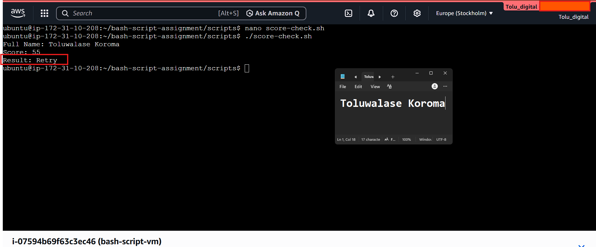

---

### Notes

Answer the following in your own words:

**1. What is the purpose of if-else in Bash?**

The if‑else structure is used to execute different blocks of code based on whether a condition is true or false. It provides decision‑making capability within a script.

---

**2. What does `-ge` mean?**

The **-ge** operator means “greater than or equal to” and is used for numeric comparisons in Bash conditionals.

---

**3. Why should conditions be tested with different values?**

Testing conditions with different values ensures that all branches of the logic behave correctly. It helps verify that the script handles both true and false outcomes as intended.

---

**4. How can conditionals help in automation scripts?**

Conditionals allow scripts to react dynamically to different situations, such as checking file states, validating input, or making decisions based on system conditions. This enables more reliable and flexible automation.

---

# Task 8 — Functions: Final Bash Automation Script

## Goal

Create a final Bash script using functions to organize reusable code.

### Evidence

#### Screenshot 1 — Content of `final-automation.sh`

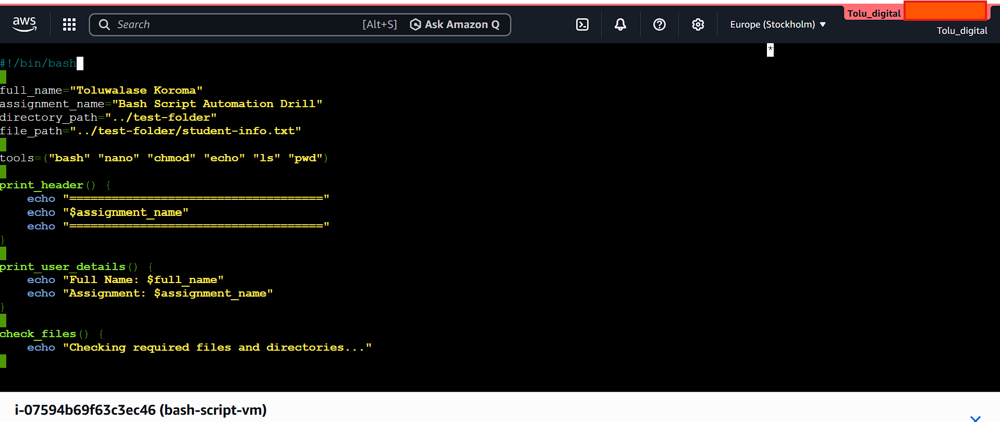

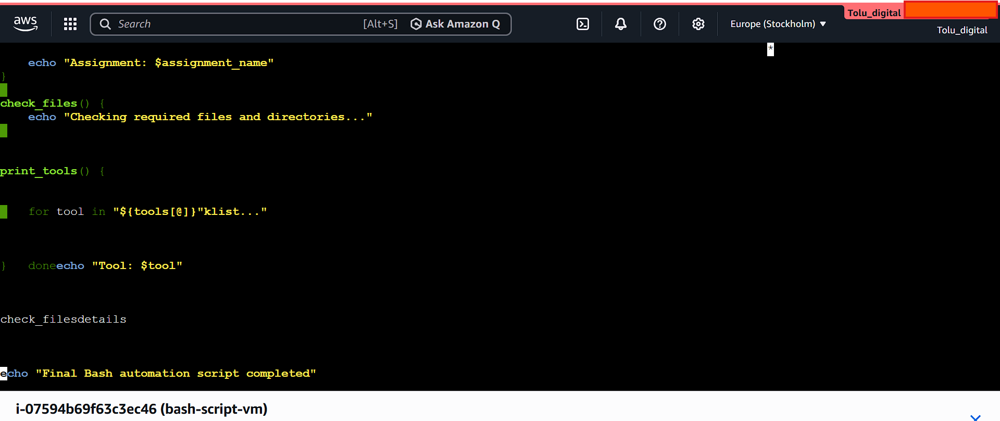

---

#### Screenshot 2 — Output of `./final-automation.sh`

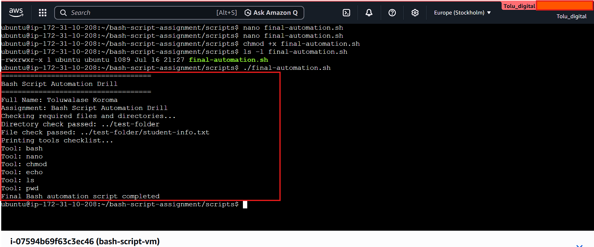

---

#### Screenshot 3 — Output of `ls -lah` showing all created scripts

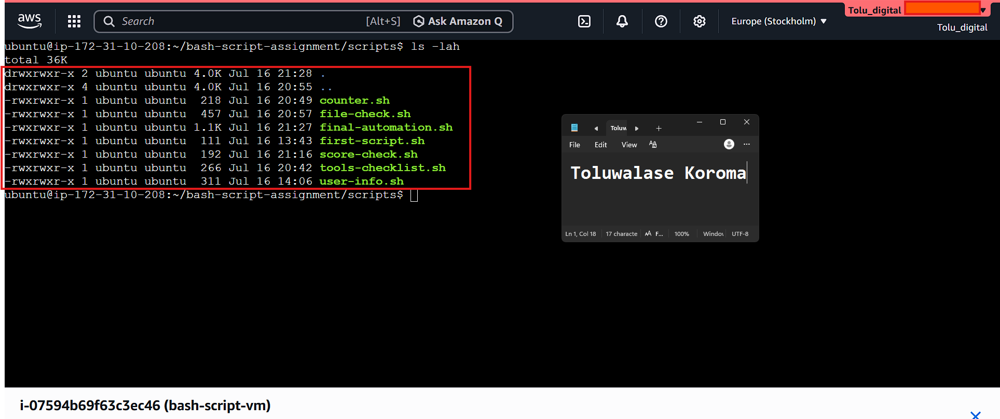

---

### Notes

Answer the following in your own words:

**1. What is a function in Bash?**

A function in Bash is a reusable block of code defined once and executed whenever its name is called. It helps organize logic and group related commands under a single label.

---

**2. Why are functions useful in scripts?**

Functions improve structure, reduce repetition, and make scripts easier to maintain. They allow complex tasks to be broken into smaller, organized units that can be executed multiple times.

---

**3. Which functions did you create in this script?**

The script included functions designed to perform specific tasks such as checking files, processing array elements, or printing status messages. Each function handled one defined operation within the workflow.

---

**4. How does this final script combine variables, arrays, loops, conditionals, files, and functions?**

The final script integrates all major Bash components:

- Variables store paths and values

- Arrays hold multiple items for processing

- Loops iterate through lists or ranges

- Conditionals make decisions based on tests

- File checks validate the presence of directories or files

- Functions group repeated logic into reusable units

Together, these elements create a structured automation flow that processes data, checks system states, and performs tasks efficiently.

---

# LinkedIn Post (Required)

## Evidence

#### LinkedIn Post URL

https://www.linkedin.com/posts/toluwalase-koroma-9678b736a_dmibypravinmishra-bash-linux-ugcPost-7483649369431527424-RKkU/?utm_source=share&utm_medium=member_desktop&rcm=ACoAAFudL58B_KdACca6x5LqOifva91Ab5ggM3o

https://medium.com/@toluismine001/-dc53d255d623?postPublishedType=initial

---

#### Screenshot — Published LinkedIn post

---

# Submission Instructions

- Add all required screenshots in your submission
- Full name must be visible in required screenshots
- All script files must be created and run successfully
- Required notes must be answered clearly for every task
- Do not expose sensitive information (keys, passwords, credentials)

---

# Completion Checklist

- [ ] Task 1: Environment setup verified, workspace created (Screenshots 1–2, Notes answered)
- [ ] Task 2: First script created, executed, permissions verified (Screenshots 1–3, Notes answered)
- [ ] Task 3: Variables script created and run (Screenshots 1–2, Notes answered)
- [ ] Task 4: Arrays and loops script created and run (Screenshots 1–2, Notes answered)
- [ ] Task 5: Counter loop script created and run (Screenshots 1–2, Notes answered)
- [ ] Task 6: File validation script created and run (Screenshots 1–3, Notes answered)
- [ ] Task 7: Pass/Retry conditional script tested with both values (Screenshots 1–4, Notes answered)
- [ ] Task 8: Final automation script created and run (Screenshots 1–3, Notes answered)
- [ ] All scripts run without errors
- [ ] Full Name visible in all required screenshots
- [ ] LinkedIn post published and URL submitted
- [ ] No sensitive data exposed

---

## 📌 About DMI & CloudAdvisory

DevOps Micro Internship (DMI) is a project-based DevOps program run by Pravin Mishra (The CloudAdvisory) focused on real-world execution, systems thinking, and career readiness.

It helps learners build strong DevOps foundations with hands-on experience.

---

## 📌 Resources

- 🌐 DMI Official Website: https://pravinmishra.com/dmi  
- 🎓 DevOps for Beginners (Udemy): https://www.udemy.com/course/devops-for-beginners-docker-k8s-cloud-cicd-4-projects/  
- 🎓 Agentic AI DevOps with Claude Code: https://www.udemy.com/course/ultimate-agentic-ai-devops-with-claude-code/  
- 🎓 DevOps with Claude Code: Terraform, EKS, ArgoCD & Helm: https://www.udemy.com/course/devops-with-claude-code-terraform-eks-argocd-helm/  
- ▶️ YouTube Playlist: https://www.youtube.com/playlist?list=PLFeSNDtI4Cho  
- 🔗 Pravin Mishra (LinkedIn): https://www.linkedin.com/in/pravin-mishra-aws-trainer/  
- 🏢 CloudAdvisory (LinkedIn): https://www.linkedin.com/company/thecloudadvisory/

---

*This submission is part of DevOps Micro Internship (DMI) Cohort 3 — Agentic AI Track.*