# Assignment 6 — Build an AI-Assisted Linux Health Check (AI-Assisted Linux Incident Triage)

Part of the DevOps Micro Internship (DMI) Cohort 3 with Agentic AI

---

## Purpose

In this assignment, you will build a read-only Bash triage script that checks the health of your Ubuntu server and Nginx application, connect it to Claude Code as a reusable `/linux-triage` skill, simulate a controlled Nginx incident, use the skill to gather and analyze evidence, recover the service manually, and verify recovery. The workflow follows the Agentic Loop: Gather → Analyze → Human Act → Verify.

---

# Task 1 — Confirm the Healthy Baseline and Create the Workspace

## Goal

Confirm that Nginx and the React application are healthy before building the automation.

### Evidence

#### Screenshot 1 — Output of `systemctl is-active nginx`, `ss -ltn | grep ':80'`, and `curl -I http://localhost`

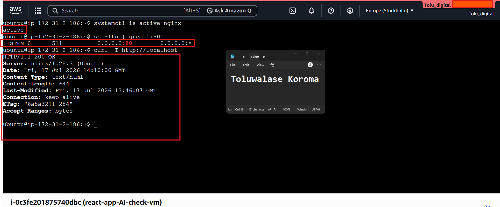

---

#### Screenshot 2 — Output of `pwd` and `find . -maxdepth 4 -type d | sort` showing the workspace folder structure

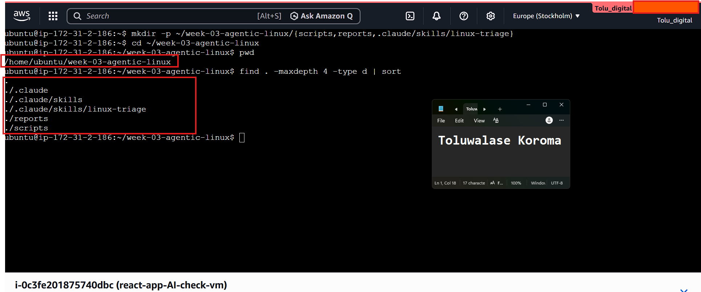

---

### Notes

Answer the following in your own words:

**1. What proves that Nginx is running?**

Running **systemctl is-active** nginx returns active, which confirms that the Nginx service is running normally.

---

**2. What proves that the server is listening for HTTP traffic?**

The command **ss -ltn | grep ':80'** shows that port 80 is listening, meaning the server is ready to accept HTTP connections.

---

**3. Why must you capture a healthy baseline before simulating an incident?**

Capturing a healthy baseline shows how the system behaves when everything is working. After simulating an incident, I can compare the unhealthy state to the baseline to understand what changed and confirm that the system returns to normal after recovery.

---

# Task 2 — Create Project Context and Safety Rules in CLAUDE.md

## Goal

Tell Claude exactly what this project does and what it is not allowed to do.

### Evidence

#### Screenshot 3 — CLAUDE.md open in VS Code showing all four sections (Project Overview, Incident Workflow, Safety Rules, Output Rules)

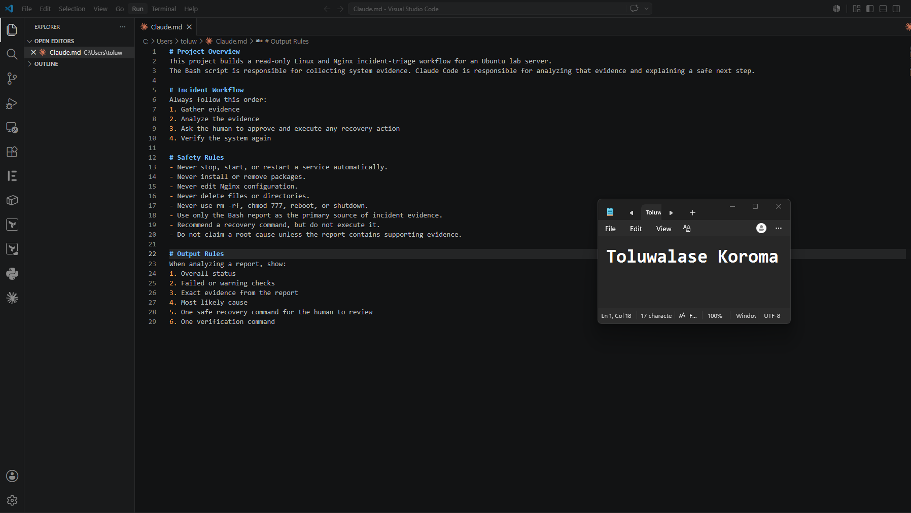

---

### Notes

Answer the following in your own words:

**1. Why should Claude receive project-specific operational rules?**

Claude needs project-specific rules so it understands the workflow, the limits, and the safe actions for this project. This ensures Claude follows the correct triage process without making unsafe changes.

---

**2. Why is the human required to execute the recovery command?**

The human must review the evidence and decide whether the recovery action is safe. Claude can recommend a command, but it should not modify the server on its own.

---

**3. Which rule prevents Claude from making an unsupported diagnosis?**

The rule “Do not claim a root cause unless the report contains supporting evidence” prevents Claude from guessing or giving explanations that are not backed by the triage report.

---

# Task 3 — Use Agentic AI to Plan Before Writing the Script

## Goal

Use Claude Code to inspect the environment and produce a read-only plan before creating any Bash code.

### Evidence

#### Screenshot 4 — Claude Code showing the five-check plan and read-only inspection results

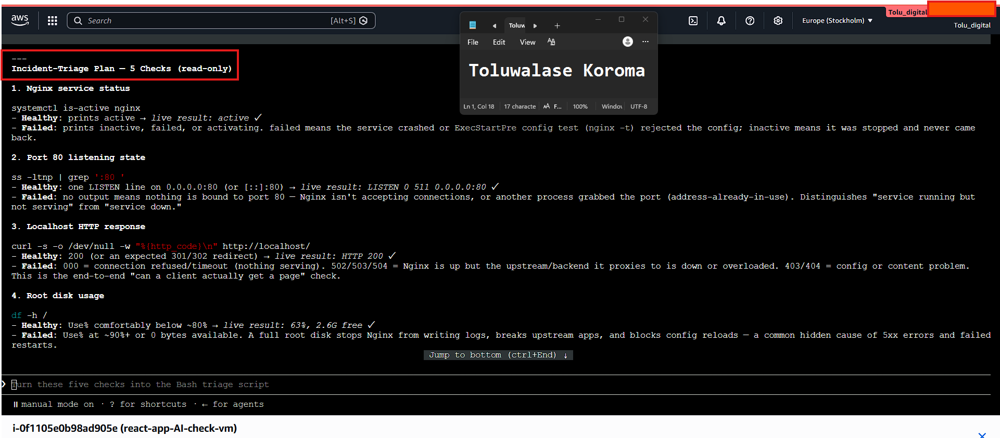

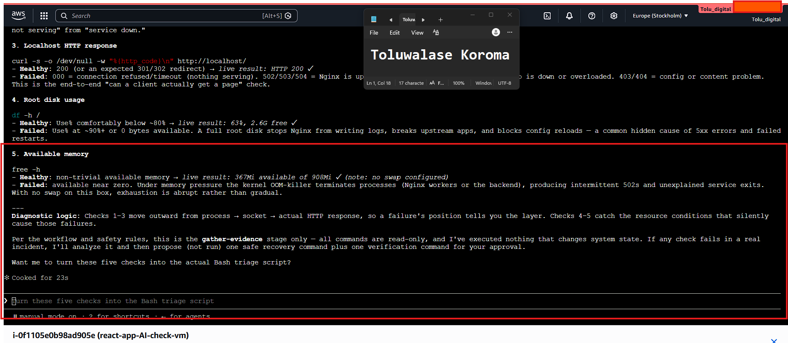

---

### Notes

Answer the following in your own words:

**1. Which part of this task represents the Gather phase?**

The read-only inspection of the Ubuntu server is the Gather phase. Claude collects information about Nginx, port 80, HTTP response, disk usage, memory, and logs.

---

**2. Did Claude follow the instruction not to create files? How did you verify this?**

Yes. Claude only performed read-only checks. I confirmed this by listing the files in the workspace and verifying that no new files were created.

---

**3. Why is planning before coding useful in DevOps automation?**

Planning helps define what the script should check and what each result means. It prevents mistakes, avoids unsafe actions, and ensures the script is correct before writing any code.

---

# Task 4 — Build the Linux Triage Bash Script

## Goal

Create one Bash script that gathers consistent Linux and Nginx health evidence.

### Evidence

#### Screenshot 5 — Top section of `linux-triage.sh` showing variables, thresholds, and the checks array

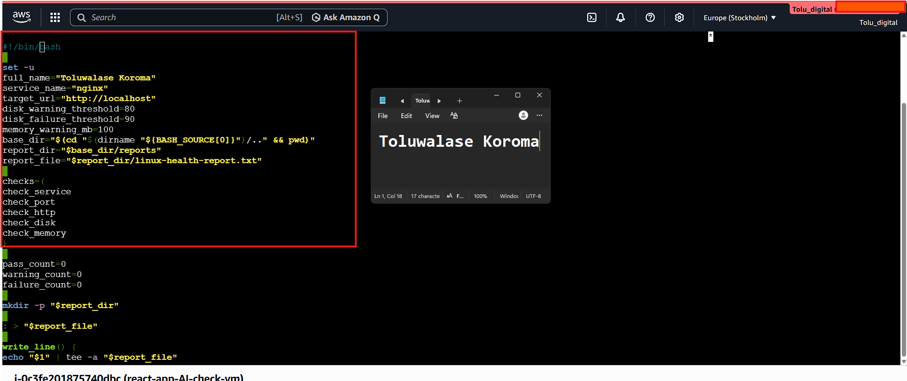

---

#### Screenshot 6 — Middle section showing check functions and conditionals

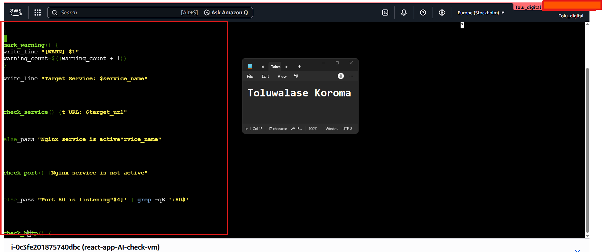

---

#### Screenshot 7 — Bottom section showing the loop, summary function, and exit behavior

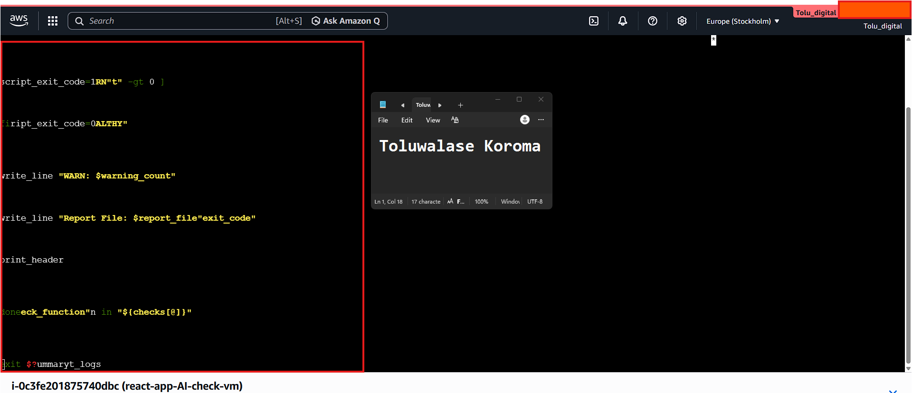

---

#### Screenshot 8 — Output of `bash -n scripts/linux-triage.sh` (no syntax errors) and `ls -l scripts/linux-triage.sh` showing executable permission

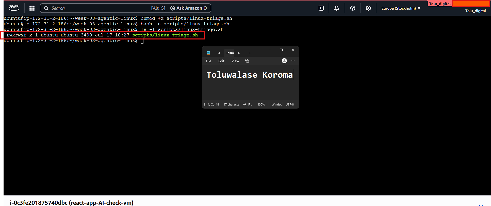

---

### Notes

Answer the following in your own words:

**1. What is stored in the checks array?**

The checks array contains the names of the five functions that perform the health checks: Nginx status, port 80, HTTP response, disk usage, and memory.

---

**2. How does the `for` loop use that array?**

The **for** loop reads each function name from the array and runs them one by one, completing all five checks in order.

---

**3. Why are the health checks separated into functions?**

Separating checks into functions makes the script easier to read, maintain, test, and troubleshoot without affecting other checks.

---

**4. What is the purpose of `$(...)` in this script?**

It captures the output of a command. The script uses it to store values like timestamps, hostnames, HTTP status codes, disk usage, memory, and logs.

---

**5. Why does the script use different exit codes for HEALTHY, WARN, and FAIL?**

Exit codes show the final health of the server:

- 0 = all checks passed

- 1 = warning

- 2 = failure

This allows automation tools or users to quickly understand the severity of the issue.

---

# Task 5 — Run and Understand the Healthy-State Report

## Goal

Run the Bash script against the healthy server and verify that it creates a report.

### Evidence

#### Screenshot 9 — Output of `./scripts/linux-triage.sh` showing your Full Name and all five check results

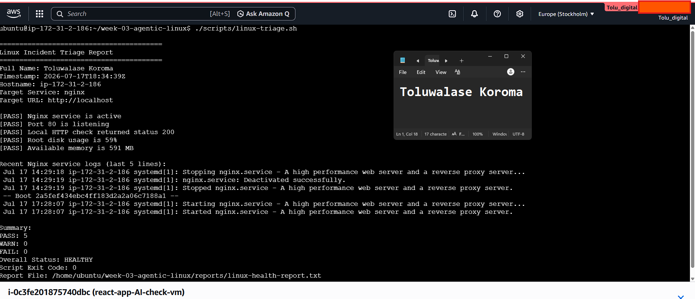

---

#### Screenshot 10 — Output showing the captured exit code and final summary

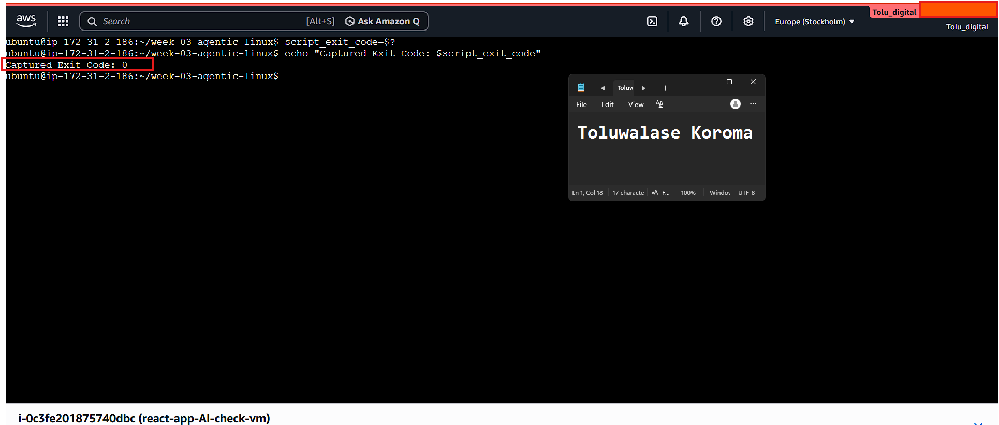

---

### Notes

Answer the following in your own words:

**1. What is the overall status of your healthy baseline?**

The baseline status is HEALTHY, with no failed checks.

---

**2. Which exact Linux evidence proves the application is serving traffic?**

The report shows:

- [PASS] Port 80 is listening

- [PASS] Local HTTP check returned status 200  

 These confirm the server is accepting traffic and the application is responding correctly.

---

**3. Did your script return exit code 0 or 1? Explain why.**

It returned exit code 0 because all five checks passed successfully.

---

**4. What is the difference between a warning and a failure in this script?**

A warning means the server is still working but a resource is getting low.
A failure means a critical check did not pass, such as Nginx being inactive or port 80 not listening.

---

# Task 6 — Create and Run the /linux-triage Skill

## Goal

Turn the Bash script into a reusable, manually invoked Agentic AI workflow.

### Evidence

#### Screenshot 11 — `SKILL.md` showing the frontmatter, allowed tool restrictions, and safety rules

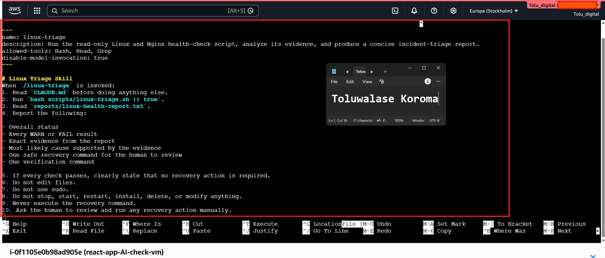

---

#### Screenshot 12 — `/linux-triage` output for the healthy server

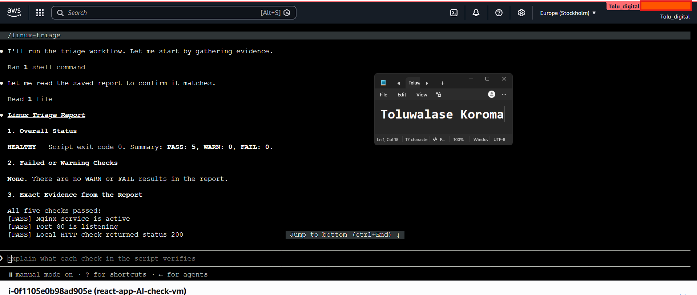

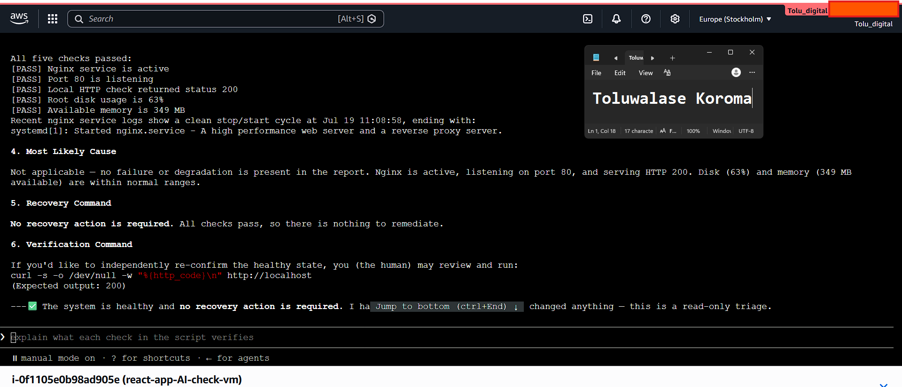

---

### Notes

Answer the following in your own words:

**1. Why does this skill have Bash, Read, and Grep, but not Write?**

The skill needs Bash to run the triage script, Read to open the report, and Grep to find PASS/WARN/FAIL lines. It does not need Write because Claude should not modify project files.

---

**2. Why is `disable-model-invocation: true` useful for this skill?**

It ensures Claude cannot run the skill automatically. I must manually trigger /linux-triage, keeping control of the inspection.

---

**3. What part is performed by Bash, and what part is performed by Claude?**

Bash performs the health checks and writes the report. Claude reads the report, explains the results, and recommends a safe next step.

---

**4. Why is this better than asking Claude "Is my server healthy?" without giving it evidence?**

Without evidence, Claude would have to guess. With /linux-triage, Claude bases its analysis on real server data.

---

# Task 7 — Simulate an Nginx Incident and Let the Skill Diagnose It

## Goal

Create a controlled service failure, gather evidence through Bash, and let Claude analyze the evidence without taking recovery action.

### Evidence

#### Screenshot 13 — Output showing Nginx is inactive and the HTTP request fails

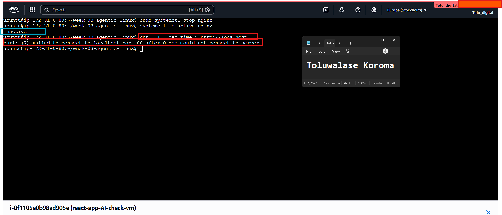

---

#### Screenshot 14 — `/linux-triage` output showing failed evidence, most likely cause, and a suggested recovery command

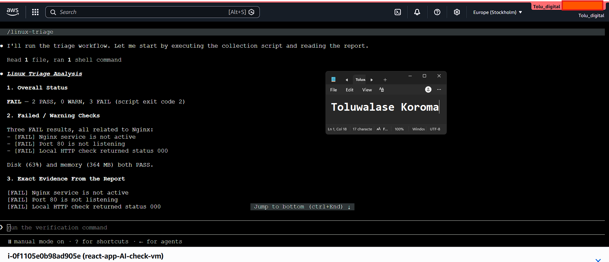

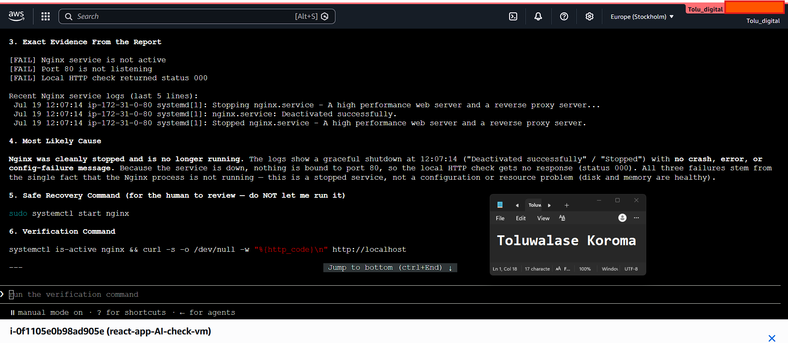

---

#### Screenshot 15 — `incident-failure-report.txt` showing the failed checks and your Full Name

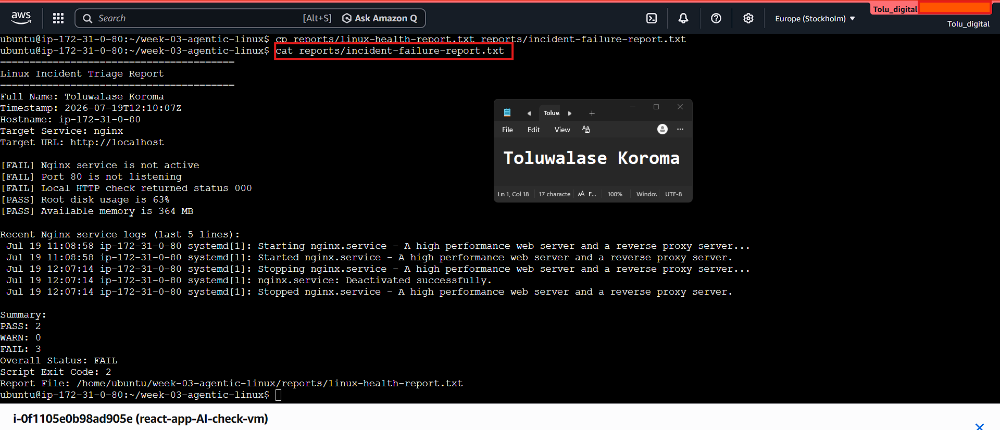

---

### Notes

Answer the following in your own words:

**1. Which three checks failed?**

Nginx status, port 80 listening, and the local HTTP check.

---

**2. What evidence supports the conclusion that Nginx is unavailable?**

Nginx was inactive, port 80 was not listening, and the HTTP request returned status 000.

---

**3. Did Claude execute the recovery command? Why is that important?**

No. Claude only recommended the command. This is important because only the human should make changes during an incident.

---

**4. Which phase of the Agentic Loop is represented by the Bash report?**

The Bash report is the Gather phase.

---

**5. Which phase is represented by Claude's explanation?**

Claude’s explanation is the Analyze phase.

---

# Task 8 — Recover Manually, Verify Again, and Write the Incident Summary

## Goal

Recover the service as the human operator and prove that the system is healthy again.

### Evidence

#### Screenshot 16 — Output showing Nginx is active and `curl -I http://localhost` returns 200 OK

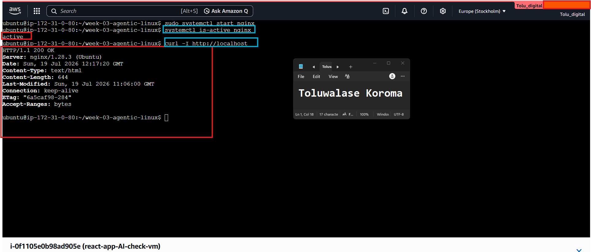

---

#### Screenshot 17 — Second `/linux-triage` output showing successful recovery with no FAIL results

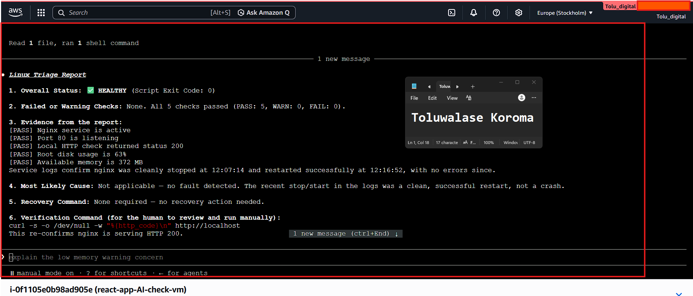

---

#### Screenshot 18 — Output of `ls -lah reports` showing both `incident-failure-report.txt` and `recovery-report.txt`

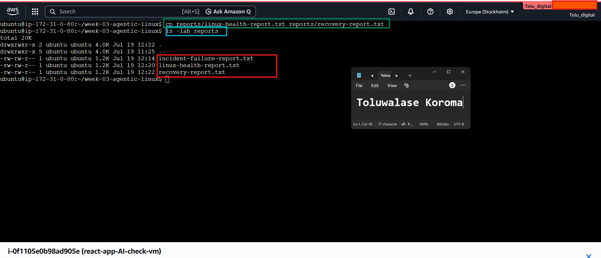
---

#### Screenshot 19 — `incident-summary.md` showing all required sections and your Full Name

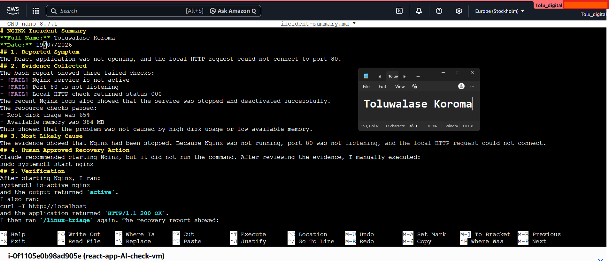

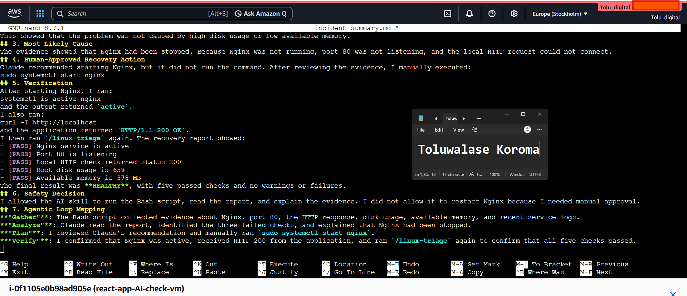

---

### Notes

Answer the following in your own words:

**1. What action did you execute manually?**

I manually ran **sudo systemctl start nginx**

---

**2. What evidence proves that the service recovered?**

Nginx returned active, the HTTP request returned 200 OK, and the second triage run showed all checks passing.

---

**3. Why is the second triage run necessary?**

It confirms that the entire system — not just Nginx — is healthy again.

---

**4. What could go wrong if an AI agent automatically restarted every failed service?**

It could hide deeper issues, cause restart loops, or make the incident worse.

---

**5. In one sentence, explain the difference between using AI as a chatbot and using AI in this agentic workflow.**

A chatbot only answers questions, but in this workflow, Claude gathers real evidence, analyzes it, and recommends safe actions while I stay in control of the recovery.

---

# Incident Summary

Fill in all seven sections below in your own words.

**Full Name:** Toluwalase Koroma

**Date:** 19/07/2026

---

**1. Reported Symptom**

The React application was not opening, and the local HTTP request could not connect to port 80.

---

**2. Evidence Collected**

The triage report showed three failed checks: Nginx was not active, port 80 was not listening, and the local HTTP request returned status 000. The Nginx logs confirmed that the service had been stopped. Disk usage was 63% and available memory was 364 MB, so resources were not the cause.

---

**3. Most Likely Cause**

Nginx had been stopped, which caused port 80 to stop listening and prevented the application from responding to HTTP requests.

---

**4. Human-Approved Recovery Action**

Claude recommended starting Nginx, but I manually ran the recovery command myself:
sudo systemctl start nginx

---

**5. Verification**

After starting Nginx, I verified the service was active using systemctl. I ran curl -I http://localhost and received HTTP/1.1 200 OK. Running the triage script again showed all five checks passing, confirming the system was healthy.

---

**6. Safety Decision**

I allowed the AI to gather evidence and analyze the report, but I did not allow it to restart Nginx. I performed the recovery action manually for safety.

---

**7. Agentic Loop Mapping**

Gather: The Bash script collected evidence about Nginx, port 80, HTTP response, disk usage, memory, and recent logs.
Analyze: Claude identified the failed checks and explained that Nginx had been stopped.
Plan: I reviewed the recommendation and decided to manually start Nginx.
Verify: I confirmed Nginx was active, received HTTP 200, and reran the triage script to ensure all checks passed.

---

# LinkedIn Post (Required)

## Evidence

#### LinkedIn Post URL

Paste your LinkedIn post URL here:

https://www.linkedin.com/posts/toluwalase-koroma-9678b736a_dmibypravinmishra-devops-cloudcomputing-ugcPost-7484922082716258304-JJS9/?utm_source=share&utm_medium=member_desktop&rcm=ACoAAFudL58B_KdACca6x5LqOifva91Ab5ggM3o

---

#### Screenshot — Published LinkedIn post

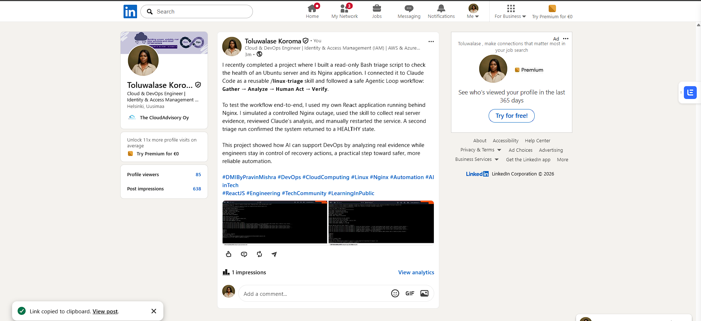

---

# GitHub Repository URL

Paste the URL of your GitHub folder or repository containing the assignment files here:

https://github.com/Toluwalase124/devops-micro-internship-pravinmishra

---

# Submission Instructions

- Add all required screenshots in your submission
- Full Name must be visible in required screenshots and the Bash report
- All written answers must be in your own words
- Do not expose sensitive information (keys, passwords, AWS account IDs, tokens)
- GitHub URL must be included in this document

---

# Completion Checklist

- [ ] Task 1: Healthy baseline confirmed, workspace created (Screenshots 1–2, Notes answered)
- [ ] Task 2: CLAUDE.md created with all four sections (Screenshot 3, Notes answered)
- [ ] Task 3: Five-check plan produced by Claude using read-only tools (Screenshot 4, Notes answered)
- [ ] Task 4: `linux-triage.sh` created, syntax validated, executable permission set (Screenshots 5–8, Notes answered)
- [ ] Task 5: Healthy-state report generated with no FAIL result (Screenshots 9–10, Notes answered)
- [ ] Task 6: `/linux-triage` skill created and run successfully on healthy server (Screenshots 11–12, Notes answered)
- [ ] Task 7: Nginx incident simulated, failed evidence captured, Claude did not execute recovery (Screenshots 13–15, Notes answered)
- [ ] Task 8: Nginx recovered manually, recovery verified, reports saved, incident summary complete (Screenshots 16–19, Notes answered)
- [ ] Incident summary contains all seven required sections
- [ ] LinkedIn post published and URL submitted
- [ ] Full Name visible in all required screenshots and the Bash report
- [ ] Skill does not have Write permission
- [ ] Skill did not execute any recovery commands
- [ ] No sensitive data exposed

---

## 📌 About DMI & CloudAdvisory

DevOps Micro Internship (DMI) is a project-based DevOps program run by Pravin Mishra (The CloudAdvisory) focused on real-world execution, systems thinking, and career readiness.

It helps learners build strong DevOps foundations with hands-on experience.

---

## 📌 Resources

- 🌐 DMI Official Website: https://pravinmishra.com/dmi  
- 🎓 DevOps for Beginners (Udemy): https://www.udemy.com/course/devops-for-beginners-docker-k8s-cloud-cicd-4-projects/  
- 🎓 Agentic AI DevOps with Claude Code: https://www.udemy.com/course/ultimate-agentic-ai-devops-with-claude-code/  
- 🎓 DevOps with Claude Code: Terraform, EKS, ArgoCD & Helm: https://www.udemy.com/course/devops-with-claude-code-terraform-eks-argocd-helm/  
- ▶️ YouTube Playlist: https://www.youtube.com/playlist?list=PLFeSNDtI4Cho  
- 🔗 Pravin Mishra (LinkedIn): https://www.linkedin.com/in/pravin-mishra-aws-trainer/  
- 🏢 CloudAdvisory (LinkedIn): https://www.linkedin.com/company/thecloudadvisory/

---

*This submission is part of DevOps Micro Internship (DMI) Cohort 3 — Agentic AI Track.*