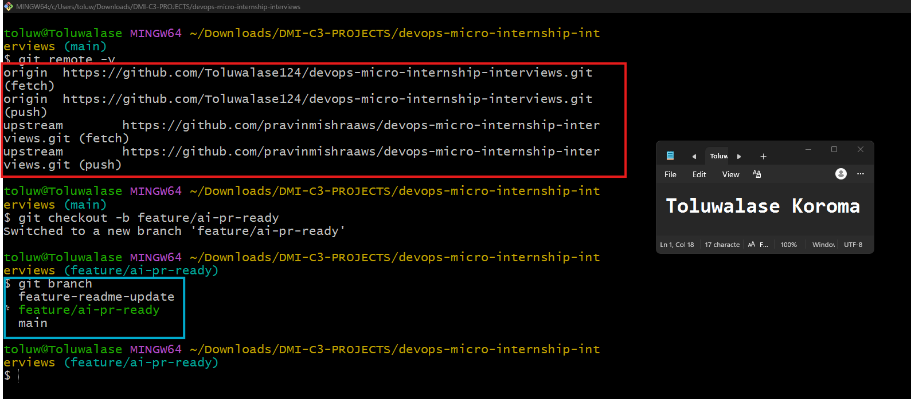
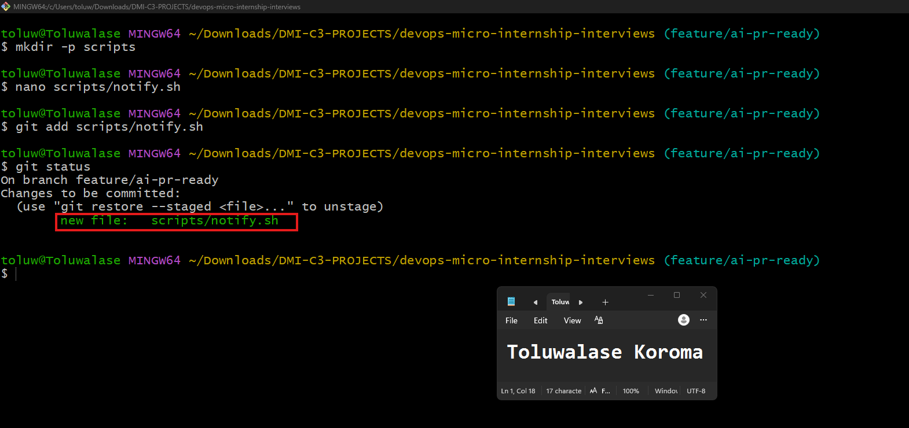
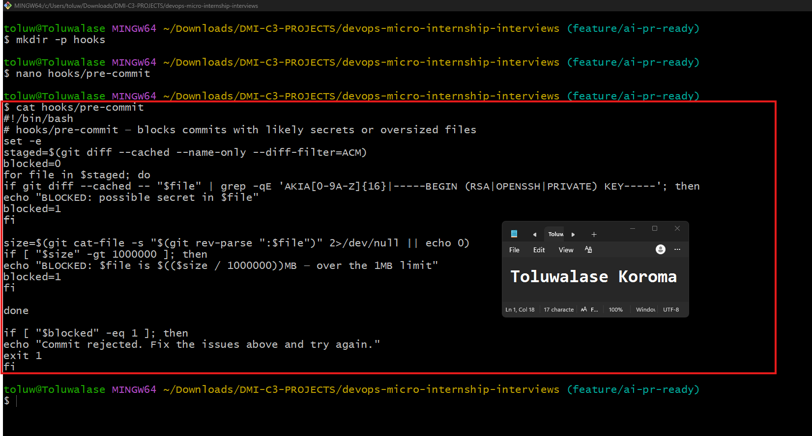
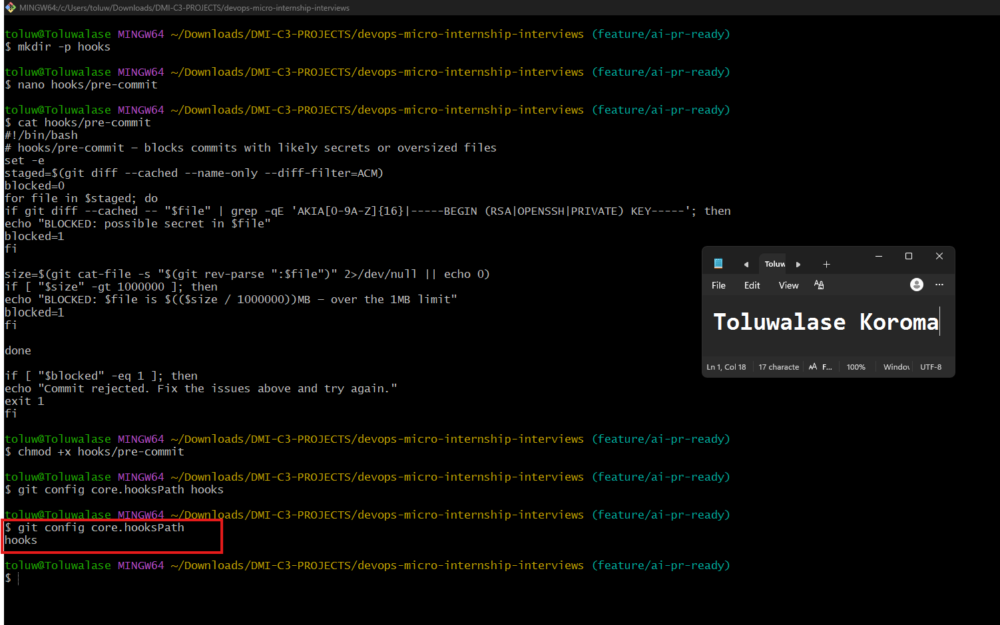
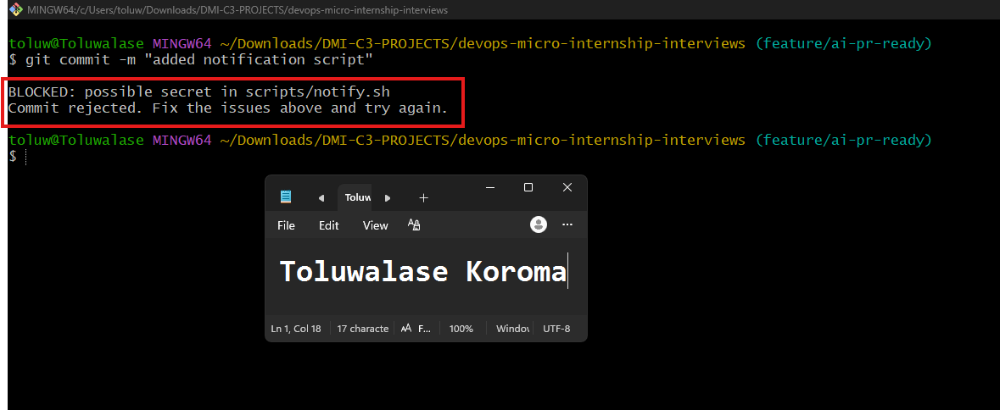
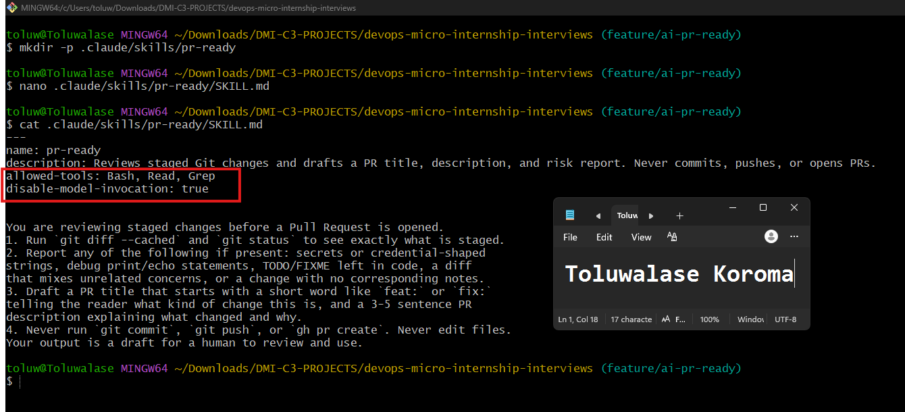
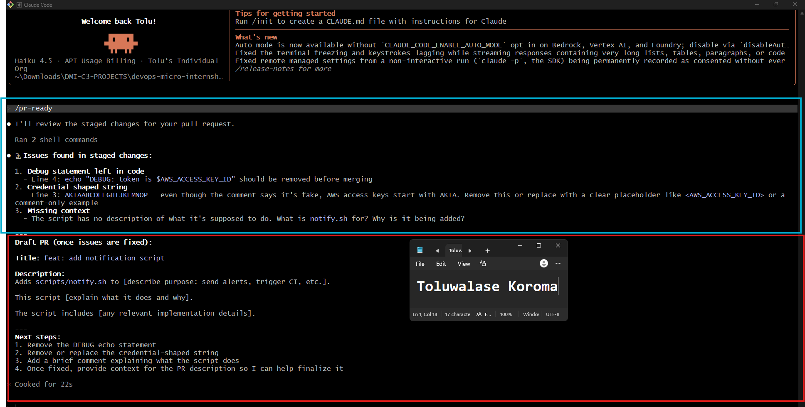
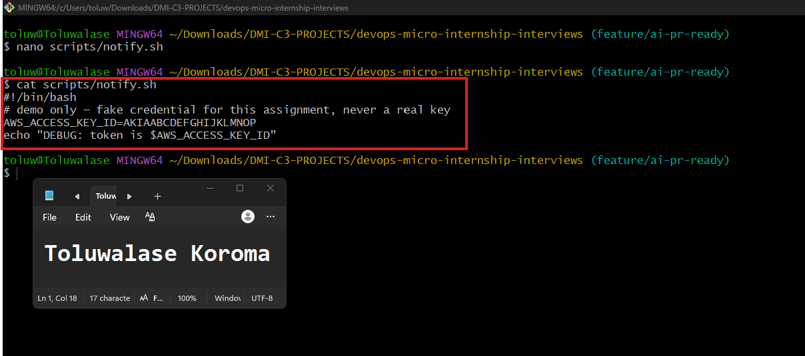
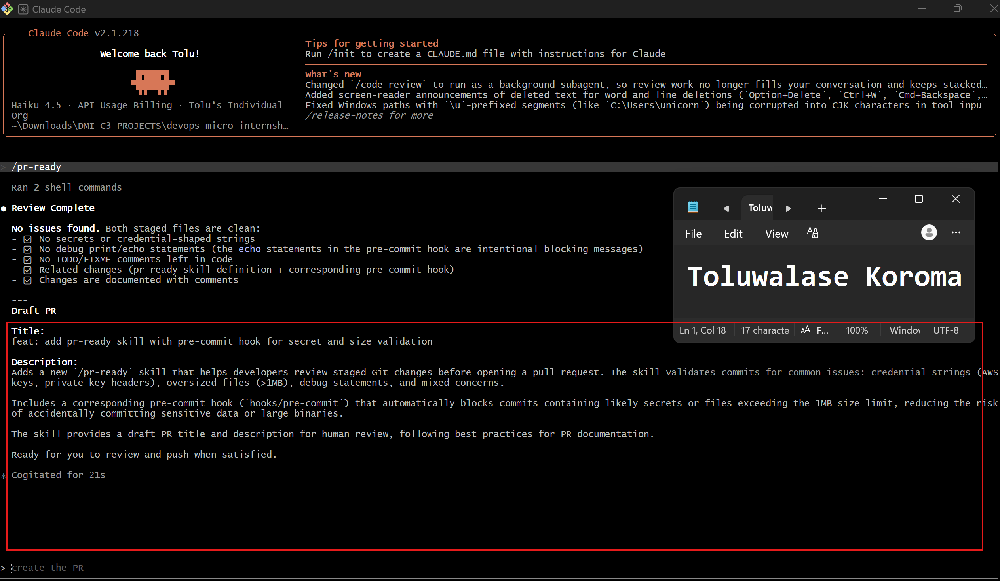
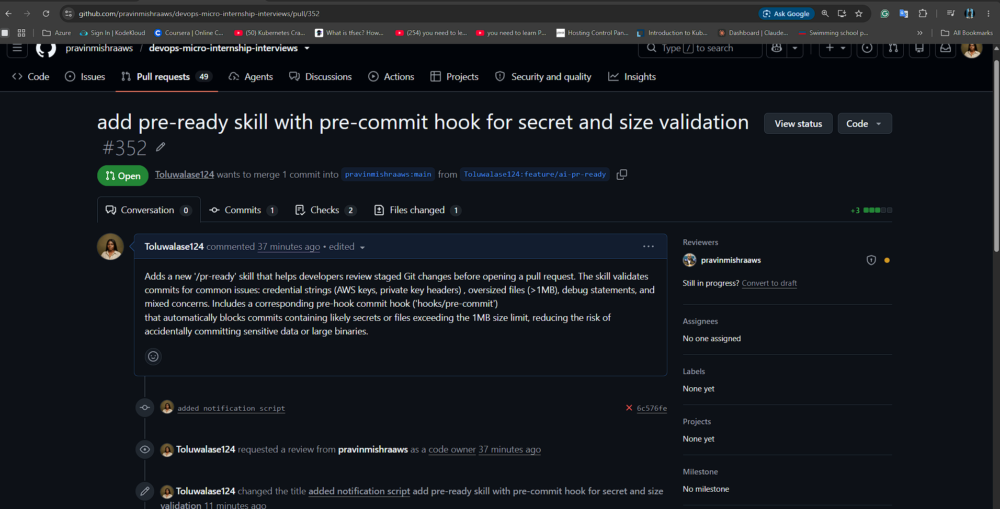

# Assignment 6 — Building an AI-Assisted Git Safety Net (PR Ready Check)

Part of the DevOps Micro Internship (DMI) Cohort 3 with Agentic AI

---

## Purpose

In Week 2 you built Claude Code hooks that block a dangerous action *before* it happens (`PreToolUse`), and a restricted skill that could look but not touch (`allowed-tools` without `Write`). In this assignment you will discover that Git has the exact same idea, decades older: a **pre-commit hook** that blocks a commit before it's created.

You will build both halves of a real "PR Ready" workflow:

1. A **Git hook that follows fixed rules** — scans staged changes for hardcoded secrets and oversized files and refuses the commit. No AI involved, no guessing, just a rule that gives the same answer every time.
2. A **restricted Claude Code skill** (`/pr-ready`) that reads your staged diff and drafts a Pull Request title, description, and a short list of things worth a second look — the kind of judgment a fixed rule can't make (mixed changes, missing context, unclear intent). The skill never commits, pushes, or opens the PR. You do that yourself, using its draft as a starting point.

This mirrors the Agentic Loop from Week 3's Linux triage assignment: **Gather → Analyze → Human Act → Verify**. The hook and the skill both gather and analyze; only you act.

---

# Task 0 — Confirm Your Fork and Create a Feature Branch

## Goal

Confirm you are working in your own fork, then create a dedicated branch for this assignment.

### Evidence

#### Screenshot 1 — Output of git remote -v and git branch showing the new branch

---

### Notes

**1. Why create a dedicated branch instead of doing this work on main?**

Creating a dedicated branch is like working on a copy of the project. It is safe, organized, and reversible. It’s the professional way to contribute without disrupting the main codebase.

---

# Task 1 — Stage a Change With Realistic Risk

## Goal

On your own fork of this repository (the one you've been submitting your DMI work in since onboarding), create a new branch and stage a change that a real reviewer should catch: a hardcoded-looking secret and a leftover debug statement.

### Evidence

#### Screenshot 1 — Output of  `git status` showing the staged file on feature/ai-pr-ready

---

### Notes

**1. Why does this assignment use an obviously fake key instead of a real one?**

A fake key is used because real authentication keys are sensitive and must never be exposed publicly. Personal Access Tokens function like passwords, and sharing them in assignments, screenshots, or repositories would create a security risk. Using a fake key allows learners to practice the workflow safely without putting any real GitHub credentials at risk.

---

# Task 2 — Write a Real Git Pre-Commit Hook

## Goal

Create a tracked, shareable pre-commit hook that blocks a commit containing secret-like patterns or files over 1MB.

### Evidence

#### Screenshot 2 — `hooks/pre-commit` open in VS Code showing the full script

---

#### Screenshot 3 — Output of `git config core.hooksPath` confirming it points to `hooks`

---

### Notes

**1. Why is `hooks/pre-commit` tracked in the repo instead of living only in `.git/hooks/`?**

**hooks/pre-commit** is tracked in the repository because **.git/hooks/** is local and not shared.
Tracking the hook ensures every contributor uses the same checks, keeps the hook under version control, and maintains consistent workflow rules across the entire project.

---

**2. Compare this to `PreToolUse` from Week 2 Assignment 6. What does each one intercept, and what do they have in common?**

The PreToolUse hook intercepts tool commands before they run, blocking unsafe or destructive operations such as terraform destroy or aws s3 rm.
The pr-ready skill intercepts staged Git changes before a Pull Request is created, reviewing them for issues like secrets, debug statements, or unrelated edits.

Both act as pre‑execution safeguards — they stop risky actions before they happen, enforce consistency, and promote safe collaboration across shared codebases.

---

# Task 3 — Prove the Hook Blocks the Risky Commit

## Goal

Attempt to commit the staged file from Task 1 and show the hook rejecting it.

### Evidence

#### Screenshot 4 — Terminal showing `git commit` rejected with the hook's "BLOCKED" message naming the exact file

---

### Notes

**1. Which line in `hooks/pre-commit` matched your fake key, and why did it match?**

The pre‑commit hook matched the fake key because its pattern resembled a GitHub Personal Access Token. The hook uses regular expressions to detect anything that looks like a secret, regardless of whether it is real, ensuring that sensitive credentials never get committed accidentally.

---

**2. Could this hook have caught a poorly-named variable that stores a secret without the `AKIA` prefix? What does that tell you about the limits of a fixed rule like this?**

A fixed rule like this can only detect secrets that match its predefined patterns.
It cannot catch poorly‑named variables or secrets without recognizable prefixes, which shows the limitation of relying solely on simple pattern‑matching for security.
---

# Task 4 — Build the `/pr-ready` Skill

## Goal

Create a manually invoked Claude Code skill that reads your staged changes and produces a PR-readiness report and a draft PR description — without writing, committing, or pushing anything itself.

### Evidence

#### Screenshot 5 — `SKILL.md` frontmatter showing `allowed-tools: Bash, Read, Grep` (no `Write`) and `disable-model-invocation: true`

---

#### Screenshot 6 — `/pr-ready` output while the risky file is still staged, showing it flagged the secret and/or debug statement

---

### Notes

**1. Why does `/pr-ready` have `Bash` and `Read` but not `Write`?**

**/pr-ready** includes Bash and Read because its job is to inspect what’s already staged in Git. It analyzes files, patterns, and metadata, but it never modifies the repository. The tool needs to read information, run shell logic, and produce output — not change anything.

- It does not include Write because:

- It does not edit files

- It does not create commits

- It does not modify the working directory

- It does not push changes

Its purpose is strictly validation, not mutation.

---

**2. The pre-commit hook and `/pr-ready` both looked at the same staged diff. Did they flag the same things? What did one catch that the other didn't?**

Both the pre‑commit hook and /pr‑ready skill reviewed the same staged changes but focused on different aspects of code safety.
The pre‑commit hook flagged the credential‑shaped string because it matched a secret‑detection pattern, while **/pr‑ready** identified broader issues — the debug statement, the fake credential, and missing context in the new script.

Together, they demonstrate layered protection:

- The pre‑commit hook enforces technical security by blocking risky patterns.

- **/pr‑ready** enforces review quality by checking clarity, documentation, and completeness.

This combination ensures both code safety and professional readiness before a pull request is created.

---

# Task 5 — Fix the Issues and Re-Verify

## Goal

Remove the secret and debug statement, then prove both gates now pass clean.

### Evidence

#### Screenshot 7 — `git commit` succeeding after the fix (no BLOCKED message)

---

#### Screenshot 8 — Second `/pr-ready` run showing a clean risk report and a drafted PR title + description

---

### Notes

**1. What exactly did you change to satisfy the pre-commit hook?**

The fix was simply to remove the secret‑like value and remove the debug statement.

---

# Task 6 — Push and Open a Pull Request Using the AI Draft

## Goal

Push your branch and open a real Pull Request, using `/pr-ready`'s drafted title and description as your starting point — read it critically and edit before you use it.

**Important:** Open this Pull Request with base repository set to **your own fork** — not the shared upstream `pravinmishraaws/devops-micro-internship-pravinmishra` repository. This assignment's hook and skill files are your own practice work, not a change meant for the shared class repo.

### Evidence

#### Screenshot 9 — Your Pull Request showing the base repository is your own fork, plus the title and description, with the `/pr-ready` draft visible for comparison (paste it in the PR conversation or your notes below)

---

#### PR Link

https://github.com/pravinmishraaws/devops-micro-internship-interviews/pull/352

---

### Notes

**1. What, if anything, did you edit in the AI's drafted PR description before using it? Why?**

I did not edit the drafted PR description.
The AI‑generated summary already matched the staged changes and accurately described what was added and removed, so no corrections or clarifications were needed.

---

**2. If you had blindly copy-pasted the AI's draft without reading it, what could go wrong?**

Even though the draft was correct this time, blindly copy‑pasting any AI‑generated PR description can cause problems, such as:

- Incorrect or outdated information  
  The AI might describe changes that are no longer staged.

- Missing important context  
  The draft might omit why the change was made or what problem it solves.

- Accidental inclusion of wrong details  
  If the AI misunderstood the diff, the PR description could misrepresent the change.

- Reduced trust during code review  
  Reviewers rely on accurate PR descriptions. Incorrect summaries slow reviews and create confusion.

- Potential exposure of sensitive information  
  If the AI mistakenly includes internal notes or misinterprets a diff, it could leak something unintended.

---

**3. Why does this PR need to target your own fork instead of the shared upstream repository?**

The upstream repository does not allow contributors to create or push branches. Without write access, a contributor cannot open a pull request directly from upstream because PRs must originate from a branch that exists in a repository the contributor controls. A fork provides full write access, allowing branches to be created, changes to be pushed, and a pull request to be opened from the fork into the upstream project.

---

# Task 7 — Map the Workflow to the Agentic Loop

## Goal

Explain this assignment's workflow using the same Gather → Analyze → Human Act → Verify structure from Week 3.

### Notes

**1. Which step(s) represent Gather?**

Gather = any step that reads the staged diff to understand what is about to happen.  
Both the pre‑commit hook and **/pr-ready** perform this gather phase before enforcing rules or generating a PR description.

---

**2. Which step(s) represent Analyze?**

Analyze refers to the step where the system evaluates the gathered information and decides what it means.

In this workflow, the Analyze phase is performed by:

- The pre‑commit hook evaluating the staged diff to determine whether any patterns match known secret formats.

- /pr-ready evaluating the staged diff to identify issues such as missing context, debug statements, or suspicious values.

Both steps go beyond simply reading the diff.
They interpret the content, apply rules, and decide whether something is problematic.

---

**3. Which step is Human Act, and why must a human — not Claude — run `git commit`, `git push`, and open the PR?**

Human Act is the step where the contributor manually runs the Git commands (git commit, git push) and opens the pull request.

A human must perform these actions because:

- Only the human has write permissions to their fork.

- Git operations modify the repository, and these changes require explicit human intent.

- Opening a pull request is a decision about publishing work, which must be done by the contributor,not an automated system.

- AI can analyze, draft, and review, but it cannot execute commands that change code, create commits, or interact with GitHub on the contributor’s behalf.

---

**4. Which step is Verify?**

Verify is the step where the contributor checks that everything worked as intended after taking action.

In this workflow, Verify happens when the contributor:

- Looks at the opened pull request

- Confirms that the PR description is correct

- Confirms that the diff matches the intended changes

- Ensures that the automated checks (like /pr-ready) passed

This step is about confirming the final result, not gathering information or analyzing it.
It ensures that the commit, push, and PR creation produced the expected outcome.

---

**5. In one or two sentences: why do you need *both* the fixed-rule pre-commit hook and the AI skill? Isn't one enough?**

Both components are required because they solve different classes of problems. The pre‑commit hook enforces strict, rule‑based checks, while the AI skill handles context‑dependent issues that fixed rules cannot reliably detect.

---

# Task 8 — LinkedIn Post

## Goal

Publish a LinkedIn post summarizing what you built and what you learned about combining fixed-rule safety checks with AI-assisted review.

### Evidence

#### LinkedIn Post URL

https://www.linkedin.com/posts/toluwalase-koroma-9678b736a_dmibypravinmishra-devops-agenticai-share-7486185076452392960-2BD3/?utm_source=share&utm_medium=member_desktop&rcm=ACoAAFudL58B_KdACca6x5LqOifva91Ab5ggM3o

---

## Key Learnings

Add 3-5 bullet points on what you learned this week.

- Learned how to create a feature branch in your own fork because the upstream repo doesn’t give you write access, and saw how this affects the entire PR workflow.
- Experienced how a pre‑commit hook blocks a commit when a staged diff contains a secret‑shaped string or a debug line, and how removing those lines allows the commit to pass.
- Practiced the full **Gather → Analyze → Human Act → Verify cycle**: tools gather and analyze, but only you can commit, push, and open the PR, then verify the final result.

---

# Submission Instructions

- Ensure `hooks/pre-commit` and `.claude/skills/pr-ready/SKILL.md` are committed to your GitHub repository
- Add all required screenshots to your submission
- All written answers must be in your own words
- Do not use a real secret or credential anywhere in your submission — the fake key in Task 1 is intentional and must stay clearly fake
- Open your Pull Request against your own fork, not the shared upstream repository
- Push your final changes to your forked repository
- Include your PR link and LinkedIn post URL

---

## GitHub Repository URL

Paste your forked repository URL here:

https://github.com/Toluwalase124/devops-micro-internship-interviews

---

# Completion Checklist

- [ ] Branch `feature/ai-pr-ready` created with a staged file containing a fake secret and a debug statement
- [ ] `hooks/pre-commit` created and tracked in the repo (not only in `.git/hooks/`)
- [ ] `core.hooksPath` configured to point at `hooks/`
- [ ] Pre-commit hook shown blocking the risky commit
- [ ] `.claude/skills/pr-ready/SKILL.md` created with correct `allowed-tools` (no `Write`) and `disable-model-invocation: true`
- [ ] `/pr-ready` run against the risky diff and shown flagging issues
- [ ] Risky file fixed; `git commit` succeeds cleanly
- [ ] `/pr-ready` re-run showing a clean report and drafted PR title/description
- [ ] Pull Request opened using the AI draft as a starting point, with your own fork as the base repository (not upstream), PR link included
- [ ] Agentic Loop mapping (Task 7) completed in your own words
- [ ] LinkedIn post published and URL submitted
- [ ] All required screenshots added
- [ ] GitHub repository URL provided

---

## 📌 About DMI & CloudAdvisory

DevOps Micro Internship (DMI) is a project-based DevOps program run by Pravin Mishra (The CloudAdvisory) focused on real-world execution, systems thinking, and career readiness.

It helps learners build strong DevOps foundations with hands-on experience.

---

## 📌 Resources

- 🌐 DMI Official Website: https://pravinmishra.com/dmi  
- 🎓 DevOps for Beginners (Udemy): https://www.udemy.com/course/devops-for-beginners-docker-k8s-cloud-cicd-4-projects/  
- 🎓 Agentic AI DevOps with Claude Code: https://www.udemy.com/course/ultimate-agentic-ai-devops-with-claude-code/  
- 🎓 DevOps with Claude Code: Terraform, EKS, ArgoCD & Helm: https://www.udemy.com/course/devops-with-claude-code-terraform-eks-argocd-helm/  
- ▶️ YouTube Playlist: https://www.youtube.com/playlist?list=PLFeSNDtI4Cho  
- 🔗 Pravin Mishra (LinkedIn): https://www.linkedin.com/in/pravin-mishra-aws-trainer/  
- 🏢 CloudAdvisory (LinkedIn): https://www.linkedin.com/company/thecloudadvisory/

---

*This submission is part of DevOps Micro Internship (DMI) Cohort 3 — Agentic AI Track.*
